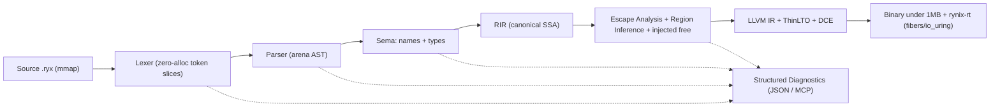

# نقشه راه اتمی ساخت زبان Rynix

## تصمیم‌های ثبت‌شده و قراردادهای پایه

- نحو: کانونیکال با بلوک‌های `def ... end`؛ بدون سمیکالن؛ `Newline` جداکننده دستورات؛ یک روش برای هر کار.
- مستندات مخزن: انگلیسی. گفتگوی ما: فارسی.
- نام‌گذاری: باینری کامپایلر `rynixc`، پسوند سورس `.ryx`، پسوند IR متنی `.rir`، کدهای خطا `RYX####`.
- پلتفرم توسعه: ویندوز (Rust 1.97.1 موجود) تا انتهای فاز Codegen کاملاً پرتابل است. فاز runtime (io_uring) روی WSL2 Ubuntu یا Docker (موجود) تست می‌شود؛ CI روی لینوکس.
- انضباط: هر گام اتمی = یک کامیت؛ هر تصمیم برگشت‌ناپذیر = یک ADR؛ هیچ فازی بدون تست و معیار پذیرش بسته نمی‌شود.

## معماری کلان خط لوله




## فاز ۰ — اسکلت ورک‌اسپیس Cargo (میکروسکوپی)

ساختار دایرکتوری:

```
D:\0\Rynix\
├── Cargo.toml            # [workspace] + workspace.lints + workspace.dependencies
├── rust-toolchain.toml   # pin روی 1.97.1
├── rustfmt.toml / .gitignore
├── docs/
│   ├── ROADMAP.md        # همین نقشه راه (انگلیسی)
│   ├── SPEC.md           # گرامر EBNF نسخه v0.1
│   ├── diagnostics.md    # رجیستری کدهای RYX
│   └── adr/              # ADR-0001..0005
├── crates/
│   ├── rynix-span        # Span/FileId/SourceMap/Interner — بدون وابستگی
│   ├── rynix-diag        # Diagnostic/Fix/DiagSink + رجیستری کدها
│   ├── rynix-lexer       # فاز ۱
│   ├── rynix-ast         # نودها + AstArena (فاز ۲)
│   ├── rynix-parser      # فاز ۲
│   └── rynixc            # درایور CLI (bin)
├── testdata/             # پیکره‌های .ryx برای snapshot و bench
└── fuzz/                 # تارگت‌های cargo-fuzz (اجرا در Linux/CI)
```

تصمیم‌های مهندسی فاز ۰:

- Edition 2024؛ lint سراسری: `unsafe_op_in_unsafe_fn = deny` + زیرمجموعه clippy pedantic.
- پروفایل release کامپایلر: `lto = "fat"`, `codegen-units = 1`, `panic = "abort"`.
- سیاست وابستگی (حداقلی، هرکدام با ADR): `memmap2`, `bumpalo`, `rustc-hash`, `memchr`؛ فقط dev: `insta`, `proptest`, `criterion`؛ فقط در rynix-diag: `serde`, `serde_json`.
- ADRها: 0001 نحو کانونیکال def/end — 0002 شناسه‌های ASCII-only در v0.1 — 0003 مدل Span سراسری u32 — 0004 لکسر تنبل صفر-تخصیص + AST آرنایی — 0005 خروجی LLVM IR متنی در گام اول.
- معیار پذیرش: `cargo build` و `cargo test` سبز روی اسکلت؛ اولین کامیت مخزن.

## فاز ۱ — Lexer فوق‌سریع با تخصیص صفر (میکروسکوپی)

### ساختارهای داده (crate‌های rynix-span و rynix-lexer)

- `Span { lo: u32, hi: u32 }` — هشت بایت، Copy؛ آفست بایتی در فضای سراسری SourceMap (سبک rustc؛ سقف ۴GiB سورس).
- `SourceFile { file_id, path, start_pos, src: SourceText, line_starts: Vec<u32> }` — `SourceText` یا `Mmap` (از memmap2) یا `Owned(String)` برای تست‌ها؛ اعتبارسنجی UTF-8 فقط یک بار هنگام load؛ تبدیل آفست به سطر/ستون فقط در مسیر سرد دیاگ (جستجوی دودویی روی line_starts).
- `Token { kind: TokenKind, span: Span }` — دوازده بایت، Copy.
- `TokenKind` با `#[repr(u8)]` و حدود ۷۰ واریانت:
  - لیترال‌ها: `IntLit` (دهدهی/0x/0o/0b با جداکننده `_`)، `FloatLit` (اعشار + توان `e`)، `StrLit` (تنها یک فرم: `"..."` با اسکیپ‌های `\n \t \\ \" \0 \x \u{}`).
  - `Ident` (فقط ASCII در v0.1) و کلیدواژه‌ها به‌صورت واریانت مجزا: `def end let mut if elif else loop for in break continue return struct enum type import pub true false nil and or not as spawn` + رزرو آینده: `match agent signal tensor`.
  - علائم: پرانتز/براکت/آکولاد، `, . : :: -> = == != < <= > >= + - * / % += -= *= /= .. ..=`.
  - ساختاری: `Newline` (پارسر داخل پرانتز/براکت آن را نادیده می‌گیرد — لکسر context-free می‌ماند)، `Comment` (`#`)، `DocComment` (`##`)، `Whitespace`، `Eof`، `Unknown` (توکن خطا).
- `Cursor<'src> { src: &'src [u8], pos: u32, base: u32 }` — لکسر تنبل و کاملاً total: هیچ ورودی‌ای panic یا fail تولید نمی‌کند؛ صفر تخصیص heap (نه بافر توکن، نه String).

### الگوریتم و بهینه‌سازی‌ها

- جدول dispatch ایستا `[LexClass; 256]` روی بایت اول؛ اسکن انتهای رشته و کامنت با `memchr`؛ تشخیص کلیدواژه با match روی (طول، بایت‌ها).
- مدیریت `\r\n` در توکن Newline؛ بایت غیر ASCII در شناسه = خطای ساختاریافته، نه panic.

### خطاهای ساختاریافته لکسر (پایه AI-Native از روز اول)

- `RYX0001` نویسه ناشناخته — `RYX0002` رشته بسته‌نشده (با Fix پیشنهادی درج `"` و confidence) — `RYX0003` شناسه غیر ASCII — `RYX0004` عدد بدفرم — `RYX0005` اسکیپ نامعتبر — `RYX0006` پایان فایل داخل رشته.
- ساختار `Diagnostic { code, severity, message, primary/secondary labels, fixes: Vec<Fix { edits, confidence, rationale }> }` در rynix-diag از همین فاز؛ رندر JSON در فاز ۳.

### تست‌های فاز ۱ (شش لایه)

- Unit: هر TokenKind + مرزها (فایل خالی، EOF وسط توکن، همه اسکیپ‌ها، لبه‌های `_` در اعداد).
- Snapshot با insta: پیکره testdata → dump توکن‌ها (kind @ lo..hi "text").
- Property با proptest: بی‌اتلاف بودن (الحاق متن همه spanها == ورودی بایت‌به‌بایت)، totality روی بایت‌های تصادفی، یکنوایی و عدم همپوشانی spanها.
- تست صفر-تخصیص: یک GlobalAlloc شمارنده؛ assert اینکه لکس یک پیکره بزرگ دقیقاً صفر تخصیص heap دارد.
- Fuzz با cargo-fuzz (اجرا در WSL2/CI).
- Bench با criterion: پیکره‌های ۱۰MB (شناسه‌محور/عددی/رشته‌ای/واقعی) + baseline کامیت‌شده؛ هدف اولیه ≥ 400MB/s تک‌هسته، هدف نهایی 1GB/s.

### معیار پذیرش فاز ۱

`rynixc lex file.ryx --dump-tokens --error-format=json` از روی mmap کار کند؛ همه تست‌ها سبز؛ گزارش bench ثبت شود.

## فاز ۲ — Parser و AST آرنایی

- آرنا: `bumpalo` پشت newtype به نام `AstArena`؛ همه نودها `&'arena` و لیست‌ها `&'arena [T]`؛ هیچ `Box/Rc/Drop/String` داخل AST (رشته‌ها `Symbol(u32)` از Interner). `NodeId(u32)` برای جداول کناری SoA در sema.
- نودهای v0.1: `Module, FnDef, StructDef, EnumDef, TypeAlias, Import` — `Let, ExprStmt, Return, Break, Continue` — لیترال‌ها، `Path, Unary, Binary, Call, MethodCall, Index, Field, If/Elif/Else, Loop, For, Block` — تایپ‌ها: `Path, Ref, Slice, Fn`.
- پارسر: recursive descent دست‌نویس + Pratt با جدول binding power (`or < and < not < cmp < range < add < mul < unary < as < postfix`)؛ بازیابی خطا با sync روی `{Newline, end, def, struct}`؛ پارسر هم total است (نود `Error` به‌جای fail).
- تست: snapshot خروجی s-expression؛ snapshot بازیابی خطا؛ round-trip با pretty-printer (هسته آینده `rynix fmt`)؛ fuzz.

## فاز ۳ — دیاگ JSON و اسکیمای MCP

- رندر دوگانه: انسانی (سبک ariadne) و `--error-format=json` به‌صورت NDJSON با اسکیمای نسخه‌دار `rynix.diag.v1` (شامل code، spanها با line/col، fixes با confidence، فاز کامپایلر) + فایل JSON Schema و تست‌های اعتبارسنجی طلایی.
- فرمان `rynixc check` (لکس + پارس + دیاگ). سرور کامل JSON-RPC 2.0 (`rynixc mcp-serve` با ابزارهای compile/diagnostics/ast_query/apply_fix) به فاز ۹ موکول می‌شود؛ اسکیما از همین‌جا ثابت است.

## فاز ۴ — تحلیل معنایی: نام‌ها و تایپ‌ها

- Scope tree با `IndexVec<ScopeId, Scope>` و رزولوشن دومرحله‌ای (جمع‌آوری آیتم‌ها، سپس بدنه‌ها)؛ `DefId(u32)`.
- `TypeCtx` با hash-consing و `TypeId(u32)`: اعداد صحیح/اعشاری، bool، str، unit، never، Struct/Enum نامی، Ref، Slice، Fn. پیش‌فرض لیترال‌ها: `i64` و `f64`.
- استنتاج فقط درون بدنه تابع (unification محلی)؛ امضای توابع همیشه صریح — لازمه تحلیل بین‌رویه‌ای و پیش‌بینی‌پذیری برای LLM.
- تست: dump تایپ‌ها؛ تست‌های directive داخل کامنت (`#^ error RYX2xxx`) به سبک rust-analyzer.

## فاز ۵ — RIR: نمایش میانی SSA کانونیکال

- ساختار SoA: `Function { blocks: IndexVec<BlockId, Block>, insts: IndexVec<InstId, Inst> }` با block-arguments (سبک Cranelift) به‌جای phi؛ حدود ۲۵ دستور شامل `alloc{site_id}` (واحد استدلال تحلیل فرار)، load/store، bounds-checked index، call، br/cond_br.
- ساخت SSA با الگوریتم Braun et al. (on-the-fly با sealed blocks)؛ verifier (dominance و type) بین همه پاس‌ها در debug.
- فرمت متنی `.rir` + پارسر آن برای تست پاس‌ها به سبک FileCheck (با insta)؛ پاس‌های پایه: DCE، const-fold، simplify-cfg، تحلیل بازه‌ای برای حذف bounds-check نسخه صفر (Presburger در فاز ۹).
- یک مفسر کوچک RIR به‌عنوان oracle برای تست تفاضلی codegen.

## فاز ۶ — تحلیل فرار و استنتاج ناحیه‌ای (قلب Zero-GC)

- شبکه فرار per-allocation-site: `NoEscape < ArgEscape < RegionEscape < GlobalEscape`؛ نگاشت: NoEscape → stack؛ ArgEscape/RegionEscape → آرنای bump ضمنی (بدون کلیدواژه region)؛ GlobalEscape → heap با `free` تزریقی کامپایلر از طریق تحلیل liveness (سبک GoFree).
- ابتدا flow-sensitive درون‌رویه‌ای روی SSA؛ سپس بین‌رویه‌ای bottom-up روی call graph با خلاصه‌های per-function و fixpoint برای SCCها؛ محافظه‌کار در FFI و فراخوانی dynamic.
- تزریق `region_create/region_reset` در نقاط dominating scope (ورود تابع، بدنه حلقه، هندلر درخواست).
- ابزار شفافیت: `rynixc check --explain-alloc` با خروجی JSON — دلیل تصمیم هر site برای انسان و AI.
- تست: پیکره directive به سبک Go (`#^ alloc: stack|region|heap`، `#^ free-at`)؛ تست تفاضلی دینامیک (runtime دیباگ، log تخصیص واقعی vs پیش‌بینی ایستا)؛ گیت متریک: ≥۹۰٪ تخصیص‌ها stack/region و صفر leak/UAF زیر sanitizerها.

## فاز ۷ — بک‌اند LLVM و باینری زیر ۱ مگابایت

- گام اول: خروجی LLVM IR متنی (بدون وابستگی به کتابخانه LLVM — روی ویندوز بی‌دردسر) و لینک با `clang -O3 -flto=thin -ffunction-sections -Wl,--gc-sections`؛ گام دوم: مهاجرت به inkwell برای پاس‌های درون‌پردازه‌ای، fat LTO و بعدها Polly/PGO.
- درمان ریشه‌ای مشکل ۴.۱MB زبان End: reachability سراسری در سطح RIR قبل از codegen — فقط توابع قابل‌دسترس از main تولید می‌شوند.
- سند `docs/abi.md` برای نمادهای `rynix_rt_*` (تخصیص، ناحیه، فایبر، I/O).
- تست: پیکره e2e (کامپایل → اجرا → assert خروجی)؛ تست الگویی روی `.ll` (مثلاً «هیچ فراخوانی heap برای site ارتقایافته به stack»)؛ گیت حجم: hello-world ایستا < 300KB و سرور http-echo < 1MB (اندازه‌گیری در CI لینوکس).

## فاز ۸ — Runtime: فایبر + io_uring (هم‌روندی بدون رنگ)

- `rynix-rt` به‌صورت staticlib با C ABI: تعویض context در x86_64 SysV با inline asm (ذخیره callee-saved + rsp؛ هدف < 30ns)؛ استک فایبر mmap با guard page، ۲۵۶KB ثابت در v0.
- زمان‌بند thread-per-core: هر هسته یک event loop و صف io_uring مستقل (crate رسمی `io-uring`)، صف اجرای محلی بدون work-stealing، injector تک‌مصرف MPSC برای spawn بین‌هسته‌ای، پارک با `io_uring_enter(min_complete=1)`.
- بدون رنگ: فراخوانی‌های به‌ظاهر مسدودکننده stdlib (read/accept/sleep) به SQE + yield فایبر lower می‌شوند؛ هیچ async/await در سطح زبان.
- محیط: نصب Ubuntu روی WSL2 یا استفاده از Docker موجود؛ بک‌اند جایگزین `--runtime=portable` (syscall مسدودکننده) تا حلقه توسعه ویندوز زنده بماند.
- تست: microbench تعویض context؛ load-test سرور echo با rewrk در برابر Go/Tokio؛ اجرای ASan/TSan؛ assert عدم نشت فایبر در خروج.

## فاز ۹ — Stdlib، ابزارها و قابلیت‌های AI

- std حداقلی روی allocatorهای ناحیه‌ای: core (Vec/Map/str)، io، fs، net، time، json.
- CLI کامل: `rynix build/run/test/fmt` + مانیفست `rynix.toml`؛ فرمتر کانونیکال بدون هیچ تنظیمی.
- `rynixc mcp-serve` کامل (JSON-RPC 2.0)؛ Presburger BCE؛ آزمایش‌های primitives هوشمند (`tensor` با بررسی ابعاد در compile-time، `signal`، `agent`).

## ترتیب اجرا پس از تأیید

بلافاصله فاز ۰ و سپس فاز ۱ را کامل پیاده‌سازی می‌کنم (todoهای زیر) و پیش از شروع فاز ۲ برای بازبینی توقف می‌کنم. سند ROADMAP.md انگلیسی معادل همین نقشه در مخزن ثبت می‌شود.