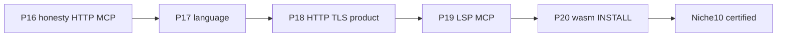
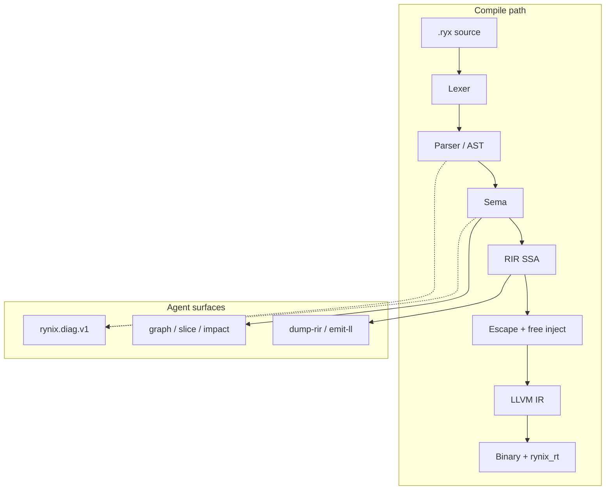
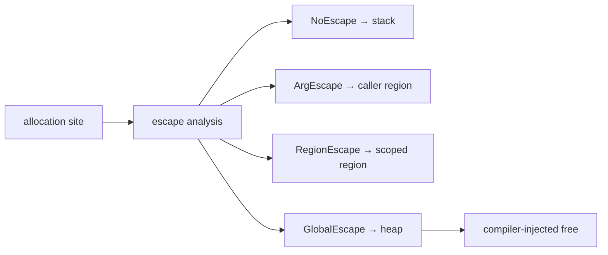

<div align="center">

[English](README.md) · **فارسی**


# Rynix

**زبان سیستم‌محور بومی هوش مصنوعی — Zero-GC، فایبر بی‌رنگ، گیت‌های صادقانه، Niche-10 گواهی‌شده.**

[](.github/workflows/ci.yml)
[](Cargo.toml)
[](LICENSE.md)
[](rust-toolchain.toml)
[](docs/ROADMAP.md)
[](docs/NICHE10.md)
[](#مدل-حافظه)
[](#نمونه-زبان)

`.ryx` · `rynixc` · [نقشه راه](docs/ROADMAP.md) · [Niche-10](docs/NICHE10.md) · [نصب](INSTALL.fa.md)

</div>

---

> این فایل ترجمهٔ همراهِ [`README.md`](README.md) است. **منبع حقیقت انگلیسی است**؛
> در تعارض، نسخهٔ انگلیسی اولویت دارد.

## فهرست مطالب

<details open>
<summary><strong>پرش به بخش</strong></summary>

- [Rynix چیست؟](#rynix-چیست)
- [Rynix چه چیزی نیست](#rynix-چه-چیزی-نیست)
- [در برابر End](#در-برابر-end)
- [بلوغ دامنه (صادقانه)](#بلوغ-دامنه-صادقانه)
- [چرا Rynix](#چرا-rynix)
- [پایپ‌لاین کامپایلر](#پایپ‌لاین-کامپایلر)
- [رانتایم و فایبر](#رانتایم-و-فایبر)
- [مدل حافظه](#مدل-حافظه)
- [شروع سریع](#شروع-سریع)
- [نمونه زبان](#نمونه-زبان)
- [بنچمارک](#بنچمارک)
- [وضعیت](#وضعیت)
- [مستندات](#مستندات)
- [مشارکت و لایسنس](#مشارکت-و-لایسنس)

</details>

---

## Rynix چیست؟

زبان سیستم برای **انسان و عامل**: یک املای کاننیکال برای هر سازه (`def`/`end`)،
JSON ساخت‌یافتهٔ `rynix.diag.v1`، و سطوح CLI/MCP/LSP بدون اسکرپ کردن stdout.

| فیلد | جزئیات |
|------|--------|
| **نسخه** | `0.1.0` — فازهای **۰–۲۰** ([ROADMAP](docs/ROADMAP.md))؛ [Niche-10](docs/NICHE10.md) گواهی‌شده |
| **کامپایلر** | فضای کاری Rust — MSRV **1.98** |
| **رانتایم** | C (`rt/`) — فایبر، TCP، JSON/HTTP، TLS/WS/crypto، io_uring / IOCP |
| **بک‌اند** | LLVM متنی → clang ThinLTO؛ `emit-wasm` بدون WASI |
| **اثبات** | تست درختی + CI — [PRODUCTION_READINESS](PRODUCTION_READINESS.md) |

---

## Rynix چه چیزی نیست

| برداشت اشتباه | واقعیت |
|---------------|--------|
| فقط نمایش بنچمارک | پایپ‌لاین کامل + رانتایم + LSP/MCP (فاز ۰–۲۰) |
| کلون Rust/Zig | سینتکس `.ryx`، RIR، escape، فایبر اختصاصی |
| عقب‌تر از End در عمق واقعی | جلو در هستهٔ shipping؛ End جلو در نمایش بروشوری — [VERDICT](docs/VERDICT.md) |
| Niche-10 = Absolute-10 vs Go | Niche-10 = سیستم+عامل+پکیج آفلاین؛ Absolute-10 رد شده |
| «بهترین ریپوی تاریخ» | فقط ادعای قابل‌ممیزی با تست/CI |

---

## در برابر End

همان تز (AI-native، Zero-GC). **داوری ممیزی (۲۰۲۶-۰۸-۲۵، peer `@cf5bef3`):**
Rynix در هستهٔ shipping جلوست؛ End در spectacle بروشور.

جدول کامل: [VERDICT.md](docs/VERDICT.md) · شکاف: [END_PEER_GAP.md](docs/END_PEER_GAP.md).

---

## بلوغ دامنه (صادقانه)

وضعیت‌ها **شواهدمحور**اند (تست/CI یا ADR تعویق):

| دامنه | وضعیت |
|-------|--------|
| باینری نیتیو / LLVM | 🟢 Shipping |
| TCP / فایبر / IOCP / uring | 🟢 Shipping |
| MCP ۱۸ ابزار + CLI عامل | 🟢 Shipping |
| LSP + VS Code (completion/rename) | 🟢 Shipping |
| HTTP محصولی + TLS/WS/crypto | 🟢 Shipping |
| پکیج محلی + attest (نه Sigstore) | 🟢 Shipping |
| WASM freestanding + host-import | 🟢 Shipping |
| Niche-10 | 🟢 Certified |
| UI/canvas، C11، Raft، WASI کامل | ⚪ Deferred / خارج |

---

## چرا Rynix

هر ✅ نقشه راه به تست یا جاب CI وصل است؛ بنچمارک اول checksum، بعد میلی‌ثانیه؛
تشخیص و graph/impact به اسکیمای JSON برای عامل‌ها.

### نقشه Niche-10



جزئیات: [docs/NICHE10.md](docs/NICHE10.md).

---

## پایپ‌لاین کامپایلر

### ASCII (همه‌جا رندر می‌شود)

```text
  .ryx source
       │
       ▼
  ┌─────────┐    ┌──────────────┐    ┌──────┐    ┌─────────┐
  │  Lexer  │───▶│ Parser / AST │───▶│ Sema │───▶│ RIR SSA │
  └─────────┘    └──────────────┘    └──┬───┘    └────┬────┘
       │                 │               │             │
       │                 └───────────────┴─────────────┤
       │                         rynix.diag.v1 ◀───────┤
       │                                             ▼
       │                              ┌──────────────────────────┐
       │                              │ Escape + region + free   │
       │                              └────────────┬─────────────┘
       │                                           ▼
       │                              ┌──────────────────────────┐
       │                              │ LLVM IR (.ll) + ThinLTO    │
       │                              └────────────┬─────────────┘
       │                                           ▼
       └──────────────────────────────▶ binary + rynix_rt (C)
```

### Mermaid



### سطح فرمان `rynixc`

```text
Core:     lex · parse · check · dump-rir [--opt] · emit-ll · emit-wasm · build · run · test · fmt · new
Agent:    graph · slice · impact · eval · patch · arch check
          verify · precheck · context · security · scope · deps · dna
Servers:  mcp-serve · lsp-serve
```

---

## رانتایم و فایبر

```text
  main thread                         fiber A              fiber B
      │                                  │                    │
      ├─ rynix_rt_run() ◀── scheduler ────┤                    │
      │       │                          │                    │
      │       ├─ tcp_recv (would block)  │                    │
      │       │      └─ PARKED ─────────▶│                    │
      │       ├─ run ready fiber ────────────────────────────▶│
      │       └─ io_uring CQ harvest (Linux, --runtime=uring) │
      │       └─ IOCP completions (Windows, --runtime=iocp) │
      │                                  │                    │
      └─ resume on I/O complete ◀────────┴────────────────────┘
```

| رانتایم | فلگ | پلتفرم |
|---------|-----|--------|
| Portable | `--runtime=portable` | پیش‌فرض ویندوز / fallback لینوکس |
| io_uring | `--runtime=uring` | لینوکس |
| IOCP | `--runtime=iocp` | ویندوز |

ABI: [docs/abi.md](docs/abi.md)

---

## مدل حافظه

```text
  NoEscape ──────▶ stack slot
  ArgEscape ─────▶ caller region / bump arena
  RegionEscape ──▶ scoped region (loop / handler)
  GlobalEscape ──▶ heap + compiler-injected free
```



```sh
rynixc check file.ryx --explain-alloc --error-format=json
```

---

## شروع سریع

```sh
# Unix
chmod +x INSTALL.sh && ./INSTALL.sh

# Windows (PowerShell)
.\install.ps1

# Manual
cargo install --path crates/rynixc --force
```

پیش‌نیاز: Rust **1.98+**، `clang` روی `PATH`. جزئیات: [INSTALL.md](INSTALL.md) · [INSTALL.fa.md](INSTALL.fa.md).

```sh
cargo test --workspace
rynixc new myapp && cd myapp && rynixc build
rynixc run examples/01_hello.ryx
rynixc check examples/03_vec.ryx --explain-alloc --error-format=json
rynixc emit-wasm testdata/wasm_arith.ryx -o target/wasm_arith.wasm
rynixc deps . --attest
```

### رفع سریع

| مشکل | راه |
|------|-----|
| `clang not found` | نصب clang سیستم / MinGW؛ `check`/`fmt`/MCP بدون clang کار می‌کنند |
| خطای لینک ویندوز | `--runtime=portable` + هدف `x86_64-pc-windows-gnu` |
| ستون Zig در Suite5 خالی | Zig اختیاری است |

---

## نمونه زبان

```ryx
def main() -> i64
  let v: Vec[i64] = vec_new(0)
  v.push(1)
  v.push(2)
  let ok = true and v.len() == 2
  match ok
    true
      return v.get(0) + v.get(1)
    false
      return 0
  end
  return -1
end
```

ساختار/`str`، index assign، enum تهی‌آرگومان، HTTP محصولی و WASM host-import در
[SPEC](docs/SPEC.md) و فازهای ۱۷–۲۰ مستند شده‌اند. کلکسیون‌ها mono `i64`
([ADR-0014](docs/adr/0014-mono-collections-niche10.md)).

---

## بنچمارک

Suite5: ۱۲ الگوریتم یکسان × چند زبان؛ **اول checksum، بعد زمان**.

```sh
python benchmarks/suite5/run_suite5.py --langs c,rust,go,zig,rynix,end --summary
```

آخرین head-to-head vs End (Phase 16-A): Rynix **۱۱** · End **۱** (`matrix`).
جزئیات و جدول: [README انگلیسی § Benchmarks](README.md#benchmarks) و
[benchmarks/suite5/README.md](benchmarks/suite5/README.md).

**صداقت:** opaque barrier مانع fold شمارندهٔ تحت‌اللفظی است؛ strength reduction
مجاز است اگر checksum یکی باشد و در Notes افشا شود — نه «همان asm در همه زبان‌ها».

---

## وضعیت

| قلمرو | جزئیات |
|-------|--------|
| Shipping | فازهای **۰–۲۰** با گیت درختی |
| Niche-10 | گواهی‌شده — [NICHE10.md](docs/NICHE10.md) |
| Deferred | C11، Raft، UI/canvas |
| خارج Niche-10 | WASI کامل، Absolute-10 vs Go، CDN اجباری |
| لایسنس | MIT OR Apache-2.0 |

---

## مستندات

| سند | محتوا |
|-----|--------|
| [README.md](README.md) | README انگلیسی (کانونیکال) |
| [INSTALL.fa.md](INSTALL.fa.md) | نصب |
| [CONTRIBUTING.fa.md](CONTRIBUTING.fa.md) | مشارکت |
| [SECURITY.fa.md](SECURITY.fa.md) | امنیت |
| [AGENTS.fa.md](AGENTS.fa.md) | راهنمای عامل |
| [docs/README.fa.md](docs/README.fa.md) | فهرست docs |
| [docs/NICHE10.md](docs/NICHE10.md) | گواهی Niche-10 |
| [docs/ROADMAP.md](docs/ROADMAP.md) | فازها |
| [docs/SPEC.md](docs/SPEC.md) | گرامر (EN normative) |

SPEC، ADR و اسکیماهای JSON به‌صورت پیش‌فرض **انگلیسی normative** می‌مانند؛
ترجمه‌های فارسی برای رویهٔ ورود/نصب/مشارکت/امنیت/عامل است.

---

## مشارکت و لایسنس

مشارکت: [CONTRIBUTING.md](CONTRIBUTING.md) · [CONTRIBUTING.fa.md](CONTRIBUTING.fa.md)

لایسنس دوگانه **MIT OR Apache-2.0** — [LICENSE.md](LICENSE.md).

---

**Rynix v0.1.0** — برای تأیید ساخته شده، نه فقط تبلیغ.
**زبان‌ها:** [English](README.md) · [فارسی](README.fa.md)
