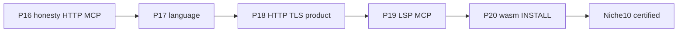
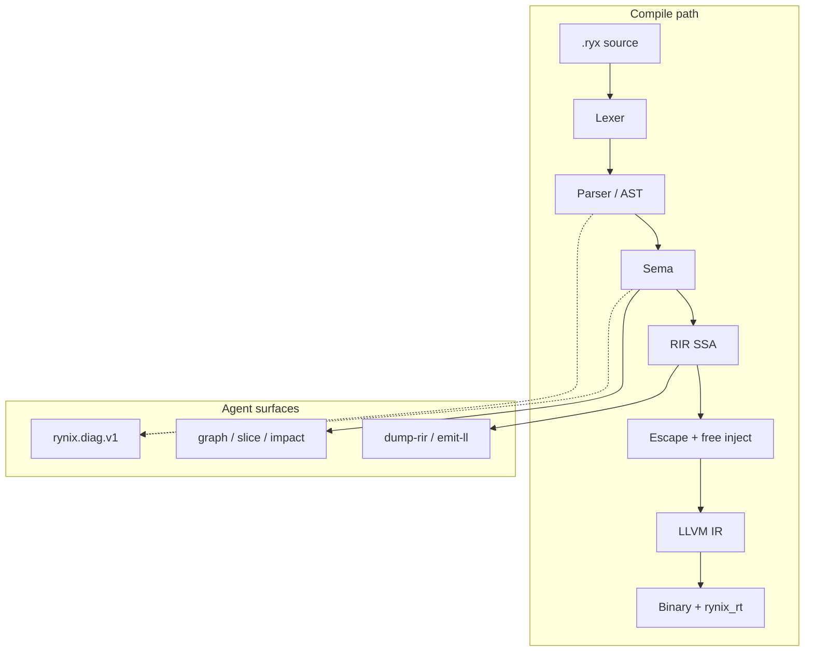
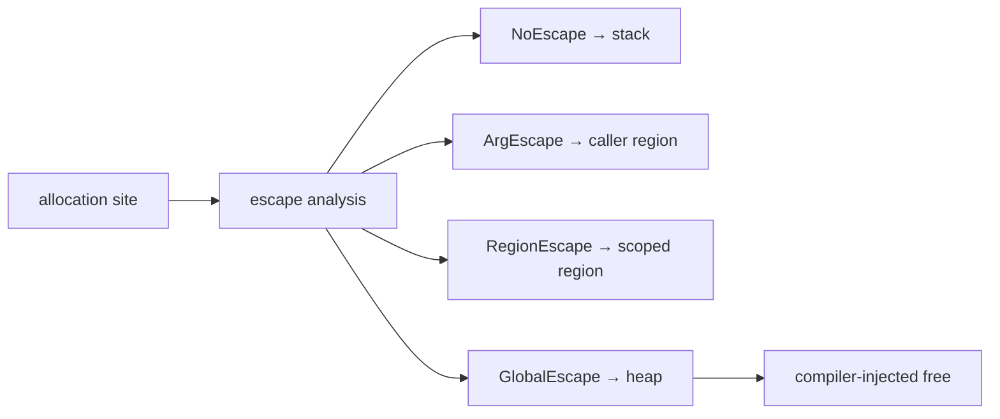

# Rynix

**Languages:** [English](README.md) (default) · [فارسی](README.fa.md)

**AI-native systems language** — canonical syntax, Zero-GC escape path, colorless
fibers, machine-readable diagnostics, textual LLVM backend, **honest** benchmarks,
and a gated **[Niche-10](docs/NICHE10.md)** product scorecard (systems + agent +
offline packages — not Absolute-10 vs Go).

`.ryx` · `rynixc` · phases **0–20** gated · [Roadmap](docs/ROADMAP.md) ·
[Niche-10](docs/NICHE10.md)


## Table of contents

- [What is Rynix?](#what-is-rynix)
- [What Rynix is NOT](#what-rynix-is-not)
- [vs End](#vs-end-irmahoend)
- [Domain maturity](#domain-maturity-honest)
- [Why Rynix](#why-rynix)
- [Compiler pipeline](#compiler-pipeline)
- [Runtime & fibers](#runtime--fibers)
- [Memory model](#memory-model)
- [Quick start](#quick-start)
- [Language snapshot](#language-snapshot)
- [Architecture guard](#architecture-guard)
- [Benchmarks](#benchmarks)
- [Acceptance gates](#acceptance-gates)
- [Editor (VS Code)](#editor-vs-code)
- [Tooling surface](#tooling-surface)
- [Repository layout](#repository-layout)
- [CI & quality](#ci--quality)
- [Status](#status)
- [Documentation](#documentation)
- [Contributing](#contributing)
- [License](#license)

---

## What is Rynix?

Rynix is a systems language built for **humans and agents**: one canonical spelling
per construct (`def`/`end`, newline statements), structured `rynix.diag.v1` JSON,
and CLI/MCP/LSP surfaces agents can call without scraping stdout.


| Field        | Detail                                                                                      |
| ------------ | ------------------------------------------------------------------------------------------- |
| **Version**  | `0.1.0` — phases **0–20** acceptance-gated ([ROADMAP](docs/ROADMAP.md)); [Niche-10](docs/NICHE10.md) certified |
| **Compiler** | Rust workspace (`crates/`) — MSRV **1.98** ([`Cargo.toml`](Cargo.toml))                     |
| **Runtime**  | C (`rt/`) — fibers, TCP, json/http, TLS/WS/crypto, io_uring (Linux) / IOCP (Win)            |
| **Backend**  | Textual LLVM IR → clang ThinLTO ([ADR-0005](docs/adr/0005-textual-llvm-ir-first.md)); `emit-wasm` freestanding (no WASI) |
| **Proof**    | In-tree tests + CI — [PRODUCTION_READINESS](PRODUCTION_READINESS.md)                        |


Zig/Go/C/Rust in [`benchmarks/suite5/`](benchmarks/suite5/) are **peer workload implementations**
(the same 12 algorithms compiled with each toolchain). The **compiler** is Rust, like
[End](https://github.com/IrMaho/End)’s `endc`. Optional 6th peer: **End** when `endc` and
`.end` ports exist — see [`END_INTEGRATION.md`](benchmarks/suite5/END_INTEGRATION.md).

---

## What Rynix is NOT

| Misread | Reality |
|--------|---------|
| ❌ Only a benchmark stunt | ✅ Full compiler pipeline + runtime + LSP/MCP (phases **0–20** gated) |
| ❌ A Rust or Zig clone | ✅ Own syntax (`.ryx`), RIR, escape model, fiber runtime |
| ❌ Losing to [End](https://github.com/IrMaho/End) on real shipping systems/agent depth | ✅ **Ahead on shipping core** (LLVM, fibers+IOCP/uring, real TLS/crypto, HTTP product path, MCP-18, Suite5 CI, VS Code LanguageClient). End leads **spectacle only** (domain wallpaper, C11/UI narrative) — [`docs/VERDICT.md`](docs/VERDICT.md) |
| ❌ Same programs as End suite12 | ✅ Suite5 uses **different**, lighter integer kernels; End #12 ≠ our `reduce.ryx` |
| ❌ Niche-10 = Absolute-10 vs Go/nginx | ✅ Niche-10 is systems+agent+offline packages ([ADR-0013](docs/adr/0013-niche-10-scorecard.md)); Absolute-10 refused |
| ❌ “Best repo in history” | ✅ **Auditable** claims: test or CI before ✅ |

---

## vs End ([IrMaho/End](https://github.com/IrMaho/End))

Same thesis (AI-native, Zero-GC, systems backend). **Audit verdict (2026-08-25,
peer `@cf5bef3`):** Rynix leads the **shipping** core; End leads **brochure**
spectacle we refuse to fake.

| | End | Rynix |
|--|-----|-------|
| Benchmarks | suite12 marketing (different programs) | Suite5: 12 kernels + **CI checksum** + optional End slot |
| Agent surface | Broad CLI names; **no MCP** | CLI + **MCP 18** + verify/contracts |
| Network / crypto | TCP real; **TLS plaintext theater** | Real TLS + HTTP loop + WS + KATs |
| Editor | LSP binary; VS Code **without** LanguageClient | LSP + **LanguageClient** + CodeLens + **completion/rename** |
| UI / C11 / CDN / Raft / llama | Marketed; mostly stubs | Deferred by ADR (honesty, not gap panic) |

**Full judgment:** [`docs/VERDICT.md`](docs/VERDICT.md) · gap log: [`docs/END_PEER_GAP.md`](docs/END_PEER_GAP.md).

---

## Domain maturity (honest)

Where End markets “every domain,” Rynix statuses are **evidence-gated** (test/CI or deferred ADR):

| Domain | Status | Evidence / pointer |
|--------|--------|-------------------|
| Systems / native binaries | 🟢 Shipping | LLVM + ThinLTO, `size_echo_gates` |
| Backend / TCP | 🟢 Shipping | fiber TCP, bakeoff docs, ASan CI |
| AI-native tooling | 🟢 Shipping | MCP 18 tools, graph/impact/eval/deps/dna schemas |
| Editor (VS Code + LSP) | 🟢 Shipping | `editors/vscode/`, CodeLens, completion, rename |
| Memory / Zero-GC | 🟢 Shipping | escape → stack/region/heap, `--explain-alloc` |
| Microbench matrix | 🟢 Shipping | Suite5 × 5–6 langs, C↔Rynix CI gate |
| suite12 MATCH ports | 🟢 Shipping | C + `.ryx` (#12/#4/#8) checksum gates; skip #1/#5/#6 ([ADR-0011](docs/adr/0011-suite12-divergent-benches.md)) |
| HTTP / JSON / TLS / WS / crypto / KV / fs | 🟢 Shipping | soft builtins + product HTTP (path_param/header/body/keepalive/TLS) — `size_echo_gates` ([SPEC §5](docs/SPEC.md)) |
| Packages (path + local index + attest) | 🟢 Shipping | unity compile SPEC §6.3; ADR-0010; `deps --attest` local digest (**not** Sigstore) |
| WASM (freestanding) | 🟢 Shipping | `emit-ll --target=wasm32…`, `emit-wasm`, Node `main` + host-import `env.print_i64` (Phases 13–15, 20) — **no WASI** |
| Niche-10 product scorecard | 🟢 Certified | [docs/NICHE10.md](docs/NICHE10.md) · [ADR-0013](docs/adr/0013-niche-10-scorecard.md) |
| Reserved stubs (`tensor`/`signal`/`agent`) | ⚪ Rejected | `RYX2013` — not product |
| Web frameworks / UI canvas | ⚪ Deferred | [ADR-0007](docs/adr/0007-deferred-ui-frameworks.md) |
| C11 backend | ⚪ Deferred | [ADR-0008](docs/adr/0008-deferred-c11-backend.md) |
| Raft / consensus product | ⚪ Deferred | [ADR-0012](docs/adr/0012-deferred-consensus.md) |
| Agent contract DSL (End-style keywords) | ⚪ Design only | [ADR-0009](docs/adr/0009-agent-contracts-toolchain.md) — toolchain evidence, not End syntax |
| Full WASI / mobile app stack | ⚪ Out of Niche-10 | host-import subset only |

---

## Why Rynix

Rynix optimizes for **agent-verifiable** delivery: every roadmap ✅ maps to a test or CI job;
benchmarks gate **checksums before milliseconds**; diagnostics and graph/impact/eval export JSON
schemas agents can consume without scraping.

| Pillar                  | Shipping today                                   | Proof                                            |
| ----------------------- | ------------------------------------------------ | ------------------------------------------------ |
| **Canonical syntax**    | `def`/`end`, newline statements                  | [`docs/SPEC.md`](docs/SPEC.md), parser snapshots |
| **Zero-GC path**        | Escape → stack / region / heap + injected `free` | `--explain-alloc`, MCP `rynix_explain_alloc`     |
| **Colorless I/O**       | Fibers + `PARKED`; io_uring (Linux) / IOCP (Win) | `rt/tests/`, ASan CI                             |
| **AI-native toolchain** | NDJSON diags, MCP (18 tools), graph/impact/eval/deps/dna  | [`docs/schemas/`](docs/schemas/), `agent_cli`    |
| **Editor + arch guard** | VS Code + LSP (diag/hover/def/**completion**/**rename**); `Architecture.toml` | `phase10_gates`, `lsp_cmd` tests, `editors/vscode/` |
| **Small binaries**      | Hello under **300 KiB** (clang gate)             | `size_echo_gates`                                |
| **Niche-10**            | Systems + agent + offline packages certified     | [docs/NICHE10.md](docs/NICHE10.md)               |


> **vs [End](https://github.com/IrMaho/End):** Rynix leads on **test-gated correctness**,
> agent toolchain depth, and real HTTP/crypto/KV/TLS/WS for features End ships in working code;
> End leads **README/framework/editor spectacle** —
> [`docs/END_PEER_GAP.md`](docs/END_PEER_GAP.md) (honest, not a marketing win claim).

### Niche-10 map (Phases 16→20)



Full axis table + gate links: [`docs/NICHE10.md`](docs/NICHE10.md).

---

## Compiler pipeline

### ASCII (renders everywhere)

```text
  .ryx source
       │
       ▼
  ┌─────────┐    ┌──────────────┐    ┌──────┐    ┌─────────┐
  │  Lexer  │───▶│ Parser / AST │───▶│ Sema │───▶│ RIR SSA │
  └─────────┘    └──────────────┘    └──┬───┘    └────┬────┘
       │                 │               │             │
       │                 └───────────────┴─────────────┤
       │                         rynix.diag.v1 ◀───────┤
       │                                             ▼
       │                              ┌──────────────────────────┐
       │                              │ Escape + region + free   │
       │                              └────────────┬─────────────┘
       │                                           ▼
       │                              ┌──────────────────────────┐
       │                              │ LLVM IR (.ll) + ThinLTO    │
       │                              └────────────┬─────────────┘
       │                                           ▼
       └──────────────────────────────▶ binary + rynix_rt (C)
```

### Mermaid (GitHub / compatible viewers)




### `rynixc` command surface

```text
Core:     lex · parse · check · dump-rir [--opt] · emit-ll · emit-wasm · build · run · test · fmt · new
Agent:    graph · slice · impact · eval · patch · arch check
          verify · precheck · context · security · scope · deps · dna
Servers:  mcp-serve · lsp-serve
Config:   rynix.toml (optional project file)
```

`eval` is arith/print-oriented; unsupported CallExt hard-fails (no zero-default)
([AGENTS.md](AGENTS.md)).
---

## Runtime & fibers

Blocking-looking std calls lower to **fiber yield + PARKED**; Linux builds can
harvest **io_uring** completions inside `rynix_rt_run`; Windows can use **IOCP**
(AcceptEx/ConnectEx + WSARecv/WSASend) with `--runtime=iocp`.

```text
  main thread                         fiber A              fiber B
      │                                  │                    │
      ├─ rynix_rt_run() ◀── scheduler ────┤                    │
      │       │                          │                    │
      │       ├─ tcp_recv (would block)  │                    │
      │       │      └─ PARKED ─────────▶│                    │
      │       ├─ run ready fiber ────────────────────────────▶│
      │       └─ io_uring CQ harvest (Linux, --runtime=uring) │
      │       └─ IOCP completions (Windows, --runtime=iocp) │
      │                                  │                    │
      └─ resume on I/O complete ◀────────┴────────────────────┘
```


| Runtime  | Flag                 | Platform                               |
| -------- | -------------------- | -------------------------------------- |
| Portable | `--runtime=portable` | Windows (default), Linux fallback      |
| io_uring | `--runtime=uring`    | Linux when built with `RYNIX_RT_URING` |
| IOCP     | `--runtime=iocp`     | Windows when built with `RYNIX_RT_IOCP` |


ABI reference: [`docs/abi.md`](docs/abi.md)

---

## Memory model

Escape analysis assigns each allocation site a tier; the compiler injects `free`
where heap escape is proven.

```text
  NoEscape ──────▶ stack slot
  ArgEscape ─────▶ caller region / bump arena
  RegionEscape ──▶ scoped region (loop / handler)
  GlobalEscape ──▶ heap + compiler-injected free
```



```sh
rynixc check file.ryx --explain-alloc --error-format=json
```

---

## Quick start

### Install

```sh
# Unix
chmod +x INSTALL.sh && ./INSTALL.sh

# Windows (PowerShell)
.\install.ps1

# Manual
cargo install --path crates/rynixc --force
```

**Prerequisites:** Rust **1.98+** (see [`Cargo.toml`](Cargo.toml) / [`rust-toolchain.toml`](rust-toolchain.toml)), `clang` on `PATH`.
Windows: use `--runtime=portable` and MinGW `x86_64-w64-mingw32-clang` + `x86_64-pc-windows-gnu`.
Linux: optional `--runtime=uring` when built with `RYNIX_RT_URING`. Details: [INSTALL.md](INSTALL.md).

### First run

```sh
cargo test --workspace

rynixc new myapp && cd myapp && rynixc build
rynixc run examples/01_hello.ryx
rynixc check examples/03_vec.ryx --explain-alloc --error-format=json
rynixc graph examples/02_match_loop.ryx
rynixc arch check
rynixc build examples/03_vec.ryx -o target/ex_vec --runtime=portable
rynixc run examples/05_http_json.ryx    # json_get_i64 → stdout 42
```

### Project config (`rynix.toml`)

Optional manifest beside your sources (see repo root for a sample):

```toml
[package]
name = "myapp"
version = "0.1.0"
entry = "src/main.ryx"
# files = ["extra.ryx"]   # optional extra sources (SPEC §6.3)

[build]
runtime = "portable"   # Windows default; Linux may use "uring"
optimize = true

# Path deps and optional local package index (no network CDN).
# See docs/adr/0010-local-package-index.md and `rynixc deps`.
[dependencies]
# util = { path = "../util" }
# util = "0.1.0"   # resolves via [registry] below
#
# [registry]
# path = "vendor"
```

`rynixc build` / `run` accept a `.ryx` path, a package directory, `rynix.toml`,
or omit the path to use cwd (`find_manifest`). Root packages compile
`[package].entry` then `files` as one primary unity unit. CLI `--runtime=`
wins when present; otherwise `[build].runtime` from the root manifest; else
portable. CLI `--opt` / `--no-opt` win when present; otherwise
`[build].optimize`; else optimize defaults **on** for build/run
([PHASE13.md](docs/PHASE13.md)). Cross emit: `rynixc emit-ll file.ryx
--target=wasm32-unknown-unknown` (clang `-c` smoke); `rynixc emit-wasm file.ryx
-o out.wasm` links a real `\0asm` binary via clang (no WASI / no `rt/` —
[PHASE14.md](docs/PHASE14.md)); Node can run `main` on arith fixtures
([PHASE15.md](docs/PHASE15.md)). Broken path deps fail the build gate. Resolve with
`rynixc deps [path] --error-format=json`
(includes a `lock` object). Pin with `rynixc deps --lock` → `rynix.lock.toml` at package or workspace root;
`--locked` requires a matching pin. Attest with `rynixc deps --attest` →
`rynix.attest.v1.json` (offline SHA-256 of the lock; not Sigstore Rekor).
Workspace members use `{ workspace = true }`
(SPEC §6.6). Soft `fs_*` builtins cover whole-file I/O
(`fs_write_file` / `fs_read_file` / `fs_exists` / `fs_remove_file`).

### Verify (CI-equivalent)

```sh
cargo clippy -p rynixc -p rynix-rir -p rynix-codegen -p rynix-sema -- -D warnings
rynixc arch check --error-format=json
python benchmarks/suite5/run_suite5.py --langs c,rynix
cd editors/vscode && npm ci && npm run compile
```

### FAQ (quick fixes)

| Problem | Fix |
| ------- | --- |
| **`clang not found`** (build/run) | Install system `clang` (Linux/macOS) or MinGW `x86_64-w64-mingw32-clang` on PATH (Windows). `check` / `fmt` / MCP work without clang. |
| **Windows link errors** | Pass `--runtime=portable`; target `x86_64-pc-windows-gnu`. See [INSTALL.md](INSTALL.md). |
| **Zig column missing in Suite5** | Zig is optional — install `zig` on PATH or run `--langs c,rust,go,rynix` / `--langs c,rynix` (CI subset). |
| **Checksum mismatch C ↔ Rynix** | Do not change workload constants; run `cargo test -p rynixc --test phase10_gates`. |
| **Slow or odd benchmark ms** | Re-run `python benchmarks/suite5/run_suite5.py --summary`; ratios vary by machine (±5–15%). |

---

## Language snapshot

```ryx
def main() -> i64
  let v: Vec[i64] = vec_new(0)
  v.push(1)
  v.push(2)
  let ok = true and v.len() == 2
  match ok
    true
      return v.get(0) + v.get(1)
    false
      return 0
  end
  return -1
end
```

### Examples


| File                                              | Demonstrates                |
| ------------------------------------------------- | --------------------------- |
| [`01_hello.ryx`](examples/01_hello.ryx)           | `print`                     |
| [`02_match_loop.ryx`](examples/02_match_loop.ryx) | `match` + `loop`            |
| [`03_vec.ryx`](examples/03_vec.ryx)               | `Vec[i64]` methods          |
| [`04_bool_logic.ryx`](examples/04_bool_logic.ryx) | `and` / `or`                |
| [`05_http_json.ryx`](examples/05_http_json.ryx)   | `json_get_i64` (no network) |


### Soft builtins (v0.1)


| Area        | API | Evidence |
| ----------- | --- | -------- |
| I/O         | `print`, `print_i64` | host write |
| Fibers      | `spawn` (stmt), `yield`, `sleep_ms`, `now_ms`, `fiber_run` | `rt/`; ASan CI |
| Collections | `vec_*`, `map_*` | [ADR-0006](docs/adr/0006-monomorphized-collections.md) |
| TCP         | `tcp_listen`…`tcp_close` | fiber-safe `rt/` |
| JSON / HTTP | `json_*`, `http_get/post_json_i64`, `http_serve_once_*`, `http_serve_loop_*` / `_2paths_*` / `_3paths_*` / `path_param` / `header` / `post_echo` / `keepalive`, `http_tls_*` | `size_echo_gates` |
| Frames      | `frame_serve_once_echo`, `frame_client_echo` | `size_echo_gates` |
| TLS         | `tls_serve_once_echo`, `tls_client_echo`, `http_tls_serve_once_json_i64`, `http_tls_get_json_i64` | `tls_*` / `http_tls_product_smoke` |
| WebSocket   | `ws_accept_*`, `ws_frame_roundtrip_ok` | `ws_*_smoke` |
| Crypto      | soft `sha256_first_i64` / HMAC / AES-GCM; `import std::crypto` → `crypto.sha256_first_i64` (SHA only) | NIST/KAT + `build_crypto_sha_via_std` |
| KV          | `kv_new` / `kv_put` / `kv_get` / `kv_len` | arena map |
| Filesystem  | soft `fs_*`; `import std::fs` → `fs.write_file` / `exists` / … | `build_fs_roundtrip` + `build_fs_via_std_import` |
| Reserved    | `tensor`, `signal`, `agent` | **not callable** (`RYX2013`) |


Grammar: [`docs/SPEC.md`](docs/SPEC.md). Soft table must match `crates/rynix-sema/src/check.rs`.

### Language teaser (beyond hello)

- Pipeline: `x |> f` ([SPEC §3](docs/SPEC.md))
- Explicit `region … end` + Zero-GC escape (`--explain-alloc`)
- `#^ effect: pure` → `RYX2012` on impure soft calls
- Linear move of `Vec`/`Map`/struct → `RYX2011`
- Struct literals `Point { x: 1, y: 2 }` — fields **`i64` or `str`** + field store on `mut`
- Index assign `a[i] = …` on `mut` arrays/slices (Phase 17-B)
- Nullary enum values as discriminants (`let c = Green`) — [ADR-0014](docs/adr/0014-mono-collections-niche10.md) keeps mono `Vec[i64]`/`Map[i64,i64]`
- WASM: `emit-wasm` + optional host-import `env.print_i64` (no full WASI)

### Packages (local only)

Path + optional filesystem `[registry]` index (directory scan or local sparse
`index/config.json`); unity compile + `pkg__fn` mangling;
`rynix.lock.toml` via `rynixc deps --lock`; workspaces `{ workspace = true }`;
`rynixc new <name>` scaffold; `rynixc deps --attest` → `rynix.attest.v1.json`
(offline SHA-256 of the lock; **not** Sigstore Rekor).
`import std::math` / `std::fs` / `std::crypto` load real `std/*.ryx` defs (docs-only
modules stay soft-only). **No CDN** ([ADR-0010](docs/adr/0010-local-package-index.md)).
Measured hello binary ~under 300 KiB gate; see [END_PEER_GAP](docs/END_PEER_GAP.md) size notes.

---

## Architecture guard

[`Architecture.toml`](Architecture.toml) defines layout dirs and layer invariants.

```text
  Architecture.toml
        │
        ▼
  rynixc arch check ──▶ scan all .ryx under root
        │
        ├── layout: required dirs exist?
        └── invariants: forbidden imports / calls per glob
                │
                ▼
        pass │ violation_detected
                │
                └── --error-format=json → rynix.arch.v1
```

```sh
rynixc arch check
rynixc arch check --error-format=json
```

Schema: [`docs/schemas/rynix.arch.v1.json`](docs/schemas/rynix.arch.v1.json)

---

## Benchmarks

Full index: [`benchmarks/README.md`](benchmarks/README.md)

### Suite5 — 12 workloads × 5 languages (+ End optional)

Same **integer algorithms** in **Rynix · C · Rust · Go · Zig** (End when `endc` + `.end` ports exist).
Each binary prints one checksum; CI requires **C ↔ Rynix match on all 12** — **correctness
first**, not speed marketing.

```sh
python benchmarks/suite5/run_suite5.py --summary                    # 5 langs + matrix
python benchmarks/suite5/run_suite5.py --langs c,rust,go,zig,rynix,end
python benchmarks/suite5/analyze_results.py                         # rank & gap-to-fastest
python benchmarks/suite5/run_suite5.py --langs c,rynix              # CI subset (faster)
```

**Methodology:** warmup=3, runs=9, reported ms = **trimmed median** (drops min/max when runs≥5).
Override via `SUITE5_WARMUP` / `SUITE5_RUNS` or `--warmup` / `--runs`.
Schema: `rynix.suite5.v2` in [`suite5_results.json`](benchmarks/suite5/suite5_results.json).

Sample run (**Phase 16-A**, Windows, 2026-08-25; warmup=3, runs=9 — **re-run on your
machine**; numbers vary ±5–15%):

**All 12 C ↔ Rust ↔ Go ↔ Zig ↔ Rynix ↔ End checksums pass.** Trip counts use an
**opaque** barrier in every language so Suite5 cannot collapse to a host-evaluated
constant from a literal `n`. Compilers may still **strength-reduce** recognized
patterns (closed forms, `ctpop`, matrix fib, …) while peers keep the source loop
shape — documented in Notes. Suite5 measures **binary time for the same checksum**,
not identical instruction mixes.

| Workload | C     | Rust  | Go    | Zig   | Rynix   | End†  | Rynix/C   | Notes                 |
| -------- | ----- | ----- | ----- | ----- | ------- | ----- | --------- | --------------------- |
| alu      | 8.0   | 7.1   | 10.2  | 8.7   | **7.4** | 8.6   | **0.93×** | mix closed form       |
| nested   | 6.8   | 6.0   | 9.8   | 7.3   | **5.4** | 5.7   | **0.80×** | residue O(m²) loops   |
| fib      | 8.0   | 7.1   | 11.0  | 8.5   | **7.0** | 7.2   | **0.88×** | matrix power          |
| hash     | 19.1  | 18.0  | 19.9  | 19.7  | **6.8** | 15.7  | **0.36×** | poly + modpow         |
| prime    | 11.7  | 10.8  | 17.8  | 11.9  | **8.0** | 60.7  | **0.68×** | trial division        |
| sum      | 6.7   | 5.8   | 9.6   | 6.6   | **5.6** | 5.7   | **0.84×** | sum-of-squares closed |
| bits     | 497.5 | 460.5 | 451.9 | 475.8 | **90.5**| 374.5 | **0.18×** | `@llvm.ctpop`         |
| matrix   | 6.8   | 8.2   | 67.7  | 7.5   | 9.8     | **5.7** | 1.44×   | 4×4 matmul            |
| scan     | 16.5  | 15.6  | 15.8  | 17.3  | **5.7** | 11.9  | **0.35×** | inclusion-exclusion   |
| powmod   | 16.4  | 14.7  | 16.8  | 15.4  | **5.6** | 16.4  | **0.34×** | binary modpow         |
| gcd      | 201.7 | 169.9 | 212.2 | 163.9 | **111.8**| 206.2 | **0.55×** | binary / Stein        |
| reduce   | 12.8  | 14.2  | 19.7  | 13.6  | **5.6** | 14.7  | **0.44×** | mix closed form       |

† End via local `endc` ([END_INTEGRATION.md](benchmarks/suite5/END_INTEGRATION.md));
Suite5 `.end` ports use the same opaque trip-count contract as C/Rynix.
Peer still End@`cf5bef3`.

**Score this run vs End:** Rynix **11** · End **1** (`matrix`). Artifact:
[`suite5_summary_2026-08-25_phase16.txt`](benchmarks/suite5/suite5_summary_2026-08-25_phase16.txt).

Times from [`suite5_results.json`](benchmarks/suite5/suite5_results.json). Refresh:

```sh
python benchmarks/suite5/run_suite5.py --langs c,rust,go,zig,rynix,end --summary
python benchmarks/suite5/analyze_results.py
```

Details: [benchmarks/suite5/README.md](benchmarks/suite5/README.md)

#### Performance honesty

- Opaque barriers block **literal trip-count folding** of Suite5 sources.
- **Strength reduction** of recognized patterns is a compiler optimization (checksum-preserving),
  disclosed per row above — not a claim of identical work vs C/Rust/Go/Zig loops.
- Literal-bound host-fold outside Suite5 is normal and unit-tested (`fold_fixtures/`).
- Numbers **vary by machine/run**. PGO is optional and not a merge gate.

**Compiler wins (in-tree tests):** counted-loop SSA, `urem` for nonneg, `@llvm.ctpop` /
`@llvm.cttz`, closed forms / matrix fib / hash poly, Stein gcd, binary modpow,
residue nested loops, `--bench` sink RT.

### vs End [suite12](https://github.com/IrMaho/End/tree/main/benchmarks/suite12)


|       | End                                       | Rynix                                      |
| ----- | ----------------------------------------- | ------------------------------------------ |
| Shape | 12 challenges × 5 langs                   | **12 workloads × 5 langs** (Suite5)        |
| Style | Heavy sims (SDF, HFT, SHA-256, N-body, …) | Integer microkernels + checksum CI         |
| Stats | 5 runs + warmup                           | `--summary` matrix; optional local re-runs |


Different algorithms — **not row-comparable**. Rynix matches the **honest multi-lang**
shape for Suite5; End still leads on spectacle benches. For End suite12 workloads
where checksums agree across peers, see [`benchmarks/suite12/README.md`](benchmarks/suite12/README.md).
Mapping: [`benchmarks/README.md`](benchmarks/README.md).

### Other harnesses


| Harness                       | Reference                                                                    |
| ----------------------------- | ---------------------------------------------------------------------------- |
| TCP echo RPS (fibers)         | [`docs/bakeoff.md`](docs/bakeoff.md) + optional `scripts/bakeoff_go_echo.go` |
| Lexer throughput (~400 MiB/s) | [`docs/benchmarks.md`](docs/benchmarks.md)                                   |
| Hello binary size             | `hello_binary_under_300kb` in `size_echo_gates`                              |


```text
  Suite5 (CPU micro)          Bakeoff (I/O)
  ─────────────────           ─────────────
  checksum gate first         fiber TCP echo RPS
  5 langs / 12 workloads      optional Go peer
         │                           │
         └──────── benchmarks/README.md ────────┘
```

---

## Acceptance gates

Every ✅ in [`docs/ROADMAP.md`](docs/ROADMAP.md) maps to a test or CI job.


| Gate                       | Evidence                                              |
| -------------------------- | ----------------------------------------------------- |
| Hello under 300 KiB        | `size_echo_gates` (skipped if clang absent)           |
| Fiber / TCP / load / uring / IOCP | `rt/tests/`                                           |
| JSON / HTTP / TLS / WS / crypto / KV | `size_echo_gates` smokes (incl. `ws_large_echo_smoke_c`) |
| suite12 MATCH checksum ports | `benchmarks/suite12/` + `suite12_*_checksum` / `suite12_*_ryx_checksum` |
| Local package deps           | `agent_cli` (`build_pkg_reg_app_resolves_registry_deps`) |
| LLVM ↔ interpreter         | `diff_llvm_vs_interp`                                 |
| Phase 10 surface           | `phase10_gates` (arch, Suite5×12, http LLVM, VS Code) |
| RIR lowering patterns      | `binary_gcd`, `matrix_unroll`, `reduce_nonneg`, `scan_hash_lower`, … |
| LSP hover + goto-def + completion + rename | `lsp_cmd` unit tests                                   |
| AI CLI / MCP path-first JSON             | `agent_cli` (`mcp_graph_path_file`, …)                  |
| Niche-10 scorecard                       | `niche10_scorecard_links_gates` + [NICHE10.md](docs/NICHE10.md) |
| ASan runtime               | CI Ubuntu sanitizer job                               |
| Clippy `-D warnings`       | CI clippy job                                         |


---

## Editor (VS Code)

```sh
cd editors/vscode && npm install && npm run compile
# or: .\editors\vscode\install_extension.ps1
```

```text
  .ryx file ──▶ VS Code extension ──▶ rynixc lsp-serve (stdio)
                         │
                         ├── diagnostics (check pipeline)
                         ├── hover (types)
                         ├── go-to-definition (workspace members on disk)
                         ├── completion (local defs / lets)
                         ├── rename (in-document)
                         └── CodeLens (check / alloc / impact)
```


| Setting              | Purpose                |
| -------------------- | ---------------------- |
| `rynix.compilerPath` | Path to `rynixc`       |
| `rynix.enableLsp`    | Enable language server |


**v0.1:** grammar, diag, hover, def, completion, rename, CodeLens.
**Deferred:** studio / canvas ([ADR-0007](docs/adr/0007-deferred-ui-frameworks.md)).

---

## Tooling surface

### AI-native CLI


| Command                          | Schema            | Purpose                  |
| -------------------------------- | ----------------- | ------------------------ |
| `check --error-format=json`      | `rynix.diag.v1`   | Structured diagnostics   |
| `graph`                          | `rynix.graph.v1`  | Call graph + edges       |
| `impact --fn=name`               | `rynix.impact.v1` | Callers / callees        |
| `eval --json`                    | `rynix.eval.v1`   | Constant / arith eval (not full CallExt) |
| `arch check --error-format=json` | `rynix.arch.v1`   | Layer violations         |
| `verify --contract=…`            | `rynix.verify.v1` | Contract evidence        |
| `precheck`                       | `rynix.precheck.v1` | Blast-radius precheck  |
| `context`                        | `rynix.context.v1` | Context pack           |
| `security`                       | `rynix.security.v1` | AST security scan      |
| `scope`                          | `rynix.scope.v1`  | Agent write scope        |
| `deps`                           | `rynix.deps.v1`   | Path/index deps + lock   |
| `dna`                            | `rynix.dna.v1`    | Heuristic conventions    |
| `slice`                          | —                 | Human outline            |
| `patch --write`                  | —                 | Apply compiler fixes     |
| `new <name>`                     | —                 | Local package scaffold   |


```sh
rynixc graph examples/02_match_loop.ryx
rynixc impact examples/02_match_loop.ryx --fn=main
rynixc eval --json "10 + 5"
```

Schemas: [`docs/schemas/`](docs/schemas/) · Agent guide: [`AGENTS.md`](AGENTS.md)

### MCP server

Start: `rynixc mcp-serve` (stdio JSON-RPC).


| #   | Tool                  | Role                  |
| --- | --------------------- | --------------------- |
| 1   | `diagnostics`         | File diagnostics      |
| 2   | `rynix_check`         | Check pipeline        |
| 3   | `rynix_format`        | Format source         |
| 4   | `rynix_explain_alloc` | Escape / alloc sites  |
| 5   | `compile`             | Build IR / binary     |
| 6   | `ast_query`           | AST queries           |
| 7   | `apply_fix`           | Apply suggested fixes |
| 8   | `rynix_graph`         | Call graph JSON (**path-first**) |
| 9   | `rynix_impact`        | Impact analysis (**path-first**) |
| 10  | `rynix_eval`          | Eval expressions      |
| 11  | `rynix_arch`          | Architecture check    |
| 12  | `rynix_verify`        | Contract verify       |
| 13  | `rynix_precheck`      | Precheck (**path-first**) |
| 14  | `rynix_context`       | Context pack          |
| 15  | `rynix_security`      | Security scan         |
| 16  | `rynix_scope`         | Write scope           |
| 17  | `rynix_deps`          | Deps report           |
| 18  | `rynix_dna`           | DNA / conventions     |


### Release

Tag `v*` → GitHub Release: Linux + Windows `rynixc`, per-artifact SHA256,
`SHA256SUMS.txt` ([`.github/workflows/release.yml`](.github/workflows/release.yml)).

---

## Repository layout

```text
Rynix/
├── crates/                 # span → lexer → ast → parser → sema → rir → codegen
│   └── rynixc/             # CLI, LSP, MCP, arch, agent commands
├── rt/                     # rynix_rt_* runtime (C)
│   ├── include/            # public ABI header
│   ├── src/                # fiber, net, json, http, uring, collections
│   └── tests/              # C smokes (ASan in CI)
├── examples/               # runnable .ryx
├── benchmarks/suite5/      # 12 cross-lang workloads + harness
├── editors/vscode/         # LSP client + TextMate grammar
├── std/                    # prelude notes (.ryx docs)
├── docs/                   # SPEC, ROADMAP, ABI, ADRs, JSON schemas
├── Architecture.toml       # layer invariants
├── install.ps1 / INSTALL.sh
└── AGENTS.md               # guide for AI agents
```

---

## CI & quality

```text
  push / PR
     ├── test (Ubuntu + Windows)     cargo test --workspace (incl. phase10_gates)
     ├── clippy                      -D warnings
     ├── suite5-check                C ↔ Rynix checksum (12 workloads)
     ├── arch-check                  Architecture.toml
     ├── vscode-extension            npm ci && compile
     └── sanitizer (Ubuntu)          ASan: fiber, TCP, json, http, load
           └── uring smokes (Linux)   SQE + TCP + load

  workflow_dispatch (optional)
     └── Suite5 PGO                    train + benchmark + artifact upload
```

Workflows: [`.github/workflows/ci.yml`](.github/workflows/ci.yml),
[`.github/workflows/suite5-pgo.yml`](.github/workflows/suite5-pgo.yml),
[`.github/workflows/release.yml`](.github/workflows/release.yml).

---

## Status


| Scope                 | Detail                                                                                        |
| --------------------- | --------------------------------------------------------------------------------------------- |
| **Shipping**          | Phases **0–20** — [`docs/ROADMAP.md`](docs/ROADMAP.md) (each ✅ has in-tree tests)            |
| **Niche-10**          | Certified — [`docs/NICHE10.md`](docs/NICHE10.md) · [ADR-0013](docs/adr/0013-niche-10-scorecard.md) |
| **Deferred**          | C11 backend — [ADR-0008](docs/adr/0008-deferred-c11-backend.md); Raft — [ADR-0012](docs/adr/0012-deferred-consensus.md) |
| **Out of Niche-10**   | UI/canvas — [ADR-0007](docs/adr/0007-deferred-ui-frameworks.md); full WASI; Absolute-10 vs Go |
| **Perf gaps (honest)**| mono `Vec[i64]`/`Map[i64,i64]` only ([ADR-0014](docs/adr/0014-mono-collections-niche10.md)); ms ratios vary by machine/run |
| **Not claimed**       | End suite12 sims (SDF/HFT/SHA); identical Suite5 instruction mixes across langs; Sigstore Rekor |
| **License**           | MIT OR Apache-2.0 — [`LICENSE.md`](LICENSE.md) |


---

## Documentation


| Document                                             | Contents                         |
| ---------------------------------------------------- | -------------------------------- |
| [`README.fa.md`](README.fa.md)                       | Persian README (same structure)  |
| [`LICENSE.md`](LICENSE.md)                           | MIT OR Apache-2.0                |
| [`AGENTS.md`](AGENTS.md) / [`AGENTS.fa.md`](AGENTS.fa.md) | Guide for AI agents / MCP   |
| [`INSTALL.md`](INSTALL.md) / [`INSTALL.fa.md`](INSTALL.fa.md) | Install, one-path clang |
| [`CONTRIBUTING.md`](CONTRIBUTING.md) / [`CONTRIBUTING.fa.md`](CONTRIBUTING.fa.md) | Contribute |
| [`SECURITY.md`](SECURITY.md) / [`SECURITY.fa.md`](SECURITY.fa.md) | Vulnerability reporting |
| [`docs/README.md`](docs/README.md)                   | Docs hub (EN)                    |
| [`docs/NICHE10.md`](docs/NICHE10.md)                 | Niche-10 certification scorecard |
| [`docs/PHASE16.md`](docs/PHASE16.md) · [`PHASE20.md`](docs/PHASE20.md) | Recent phase notes |
| [`docs/SPEC.md`](docs/SPEC.md)                       | Grammar & builtins               |
| [`docs/abi.md`](docs/abi.md)                         | Runtime symbols                  |
| [`docs/diagnostics.md`](docs/diagnostics.md)         | `RYX####` codes                  |
| [`docs/END_PEER_GAP.md`](docs/END_PEER_GAP.md)       | Honest End peer gap & backlog    |
| [`docs/COMPARE.md`](docs/COMPARE.md)                 | Peer comparison (End, etc.)      |
| [`docs/VERDICT.md`](docs/VERDICT.md)                 | Who is ahead? (audit)            |
| [`docs/ROADMAP.md`](docs/ROADMAP.md)                 | Phase gates & evidence           |
| [`benchmarks/suite5/README.md`](benchmarks/suite5/README.md) | Suite5 harness & PGO       |
| [`PRODUCTION_READINESS.md`](PRODUCTION_READINESS.md) | Subsystem matrix                 |
| [`docs/adr/`](docs/adr/)                             | Architecture decisions           |


---

## Contributing

See [`CONTRIBUTING.md`](CONTRIBUTING.md) ([فارسی](CONTRIBUTING.fa.md)).

- Keep changes atomic and tested (`cargo test --workspace`, clippy `-D warnings`).
- Do not invent language features in docs without SPEC + tests.
- Prefer fixing the compiler over weakening a test.
- English is the **canonical** docs language; Persian companions (`.fa.md`) track the same facts.

---

## License

Dual-licensed **MIT OR Apache-2.0** — [`LICENSE.md`](LICENSE.md).

---

**Rynix v0.1.0** — built to be verified, not merely advertised. Re-run benchmarks and gates on your machine before trusting any ms ratio.
**Languages:** [English](README.md) · [فارسی](README.fa.md)

