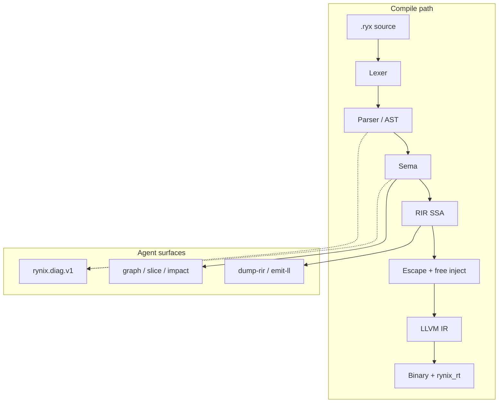
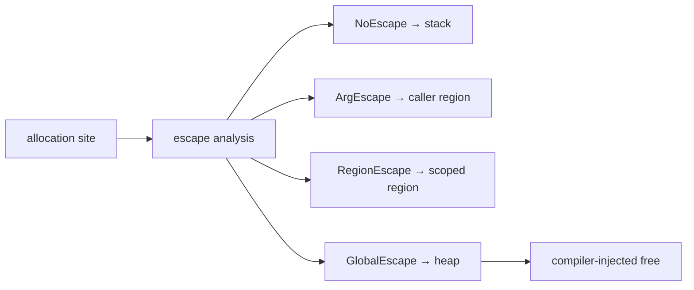

# Rynix

**AI-native systems language** — canonical syntax, Zero-GC escape path, colorless
fibers, machine-readable diagnostics, textual LLVM backend, **honest** benchmarks.

`.ryx` · `rynixc` · phases **0–10** gated · [Roadmap](docs/ROADMAP.md)


[What is Rynix?](#what-is-rynix) · [Why Rynix](#why-rynix) · [What Rynix is NOT](#what-rynix-is-not) · [vs End](#vs-end-irmahoend) · [Quick start](#quick-start) · [Pipeline](#compiler-pipeline) · [Runtime](#runtime--fibers) · [Memory](#memory-model) · [Tooling](#tooling-surface) · [Benchmarks](#benchmarks) · [FAQ](#faq-quick-fixes) · [Install](INSTALL.md) · [Compare](docs/COMPARE.md) · [End gap analysis](docs/END_PEER_GAP.md) · [License](LICENSE.md)

---


## What is Rynix?

Rynix is a systems language built for **humans and agents**: one canonical spelling
per construct (`def`/`end`, newline statements), structured `rynix.diag.v1` JSON,
and CLI/MCP/LSP surfaces agents can call without scraping stdout.


| Field        | Detail                                                                                      |
| ------------ | ------------------------------------------------------------------------------------------- |
| **Version**  | `0.1.0` — phases **0–10** acceptance-gated ([ROADMAP](docs/ROADMAP.md))                     |
| **Compiler** | Rust workspace (`crates/`) — MSRV **1.98** ([`Cargo.toml`](Cargo.toml))                     |
| **Runtime**  | C (`rt/`) — fibers, TCP, json/http, io_uring (Linux)                                        |
| **Backend**  | Textual LLVM IR → clang ThinLTO ([ADR-0005](docs/adr/0005-textual-llvm-ir-first.md))         |
| **Proof**    | In-tree tests + CI — [PRODUCTION_READINESS](PRODUCTION_READINESS.md)                        |


Zig/Go/C/Rust in [`benchmarks/suite5/`](benchmarks/suite5/) are **peer workload implementations**
(the same 12 algorithms compiled with each toolchain). The **compiler** is Rust, like
[End](https://github.com/IrMaho/End)’s `endc`. Optional 6th peer: **End** when `endc` and
`.end` ports exist — see [`END_INTEGRATION.md`](benchmarks/suite5/END_INTEGRATION.md).

---

## What Rynix is NOT

| Misread | Reality |
|--------|---------|
| ❌ Only a benchmark stunt | ✅ Full compiler pipeline + runtime + LSP/MCP (phases 0–10 gated) |
| ❌ A Rust or Zig clone | ✅ Own syntax (`.ryx`), RIR, escape model, fiber runtime |
| ❌ Beating [End](https://github.com/IrMaho/End) on every product axis today | ✅ Stronger correctness gates on what ships; End still leads **frameworks / editor breadth** — [`docs/END_PEER_GAP.md`](docs/END_PEER_GAP.md) |
| ❌ Same programs as End suite12 | ✅ Suite5 uses **different**, lighter integer kernels; End #12 ≠ our `reduce.ryx` |
| ❌ “Best repo in history” | ✅ **Auditable** claims: test or CI before ✅ |

---

## vs End ([IrMaho/End](https://github.com/IrMaho/End))

Same thesis (AI-native, Zero-GC, systems backend). Different maturity shape:

| | End | Rynix |
|--|-----|-------|
| Benchmarks | suite12: SDF, HFT, SHA, N-body, … | Suite5: 12 integer microkernels + **CI checksum gate** |
| Languages in matrix | End, C, Rust, Go, Zig | Rynix, C, Rust, Go, Zig, **End** (when `endc` present) |
| Agent contracts / UI / EndHyper | Broad (per End docs) | Deferred / narrow std — see gap doc |
| Proof style | Checksum per bench | **C↔Rynix CI** + LLVM↔interp + escape explain |

Full gap backlog (P0–P3): **[docs/END_PEER_GAP.md](docs/END_PEER_GAP.md)**.

---

## Domain maturity (honest)

Where End markets “every domain,” Rynix statuses are **evidence-gated** (test/CI or deferred ADR):

| Domain | Status | Evidence / pointer |
|--------|--------|-------------------|
| Systems / native binaries | 🟢 Shipping | LLVM + ThinLTO, `size_echo_gates` |
| Backend / TCP | 🟢 Shipping | fiber TCP, bakeoff docs, ASan CI |
| AI-native tooling | 🟢 Shipping | MCP 18 tools, graph/impact/eval/deps/dna schemas |
| Editor (VS Code + LSP) | 🟢 Shipping | `editors/vscode/`, CodeLens (check/alloc/impact) |
| Memory / Zero-GC | 🟢 Shipping | escape → stack/region/heap, `--explain-alloc` |
| Microbench matrix | 🟢 Shipping | Suite5 × 5–6 langs, C↔Rynix CI gate |
| suite12 MATCH ports | 🟢 Shipping | `benchmarks/suite12/` checksum gates (9 ids) |
| HTTP / JSON / TLS / WS / crypto / KV | 🟢 Shipping | `size_echo_gates`, `std/*` |
| Packages (path + local index) | 🟢 Shipping | unity compile SPEC §6.3; ADR-0010 |
| Web frameworks / UI canvas | ⚪ Deferred | [ADR-0007](docs/adr/0007-deferred-ui-frameworks.md) |
| C11 backend | ⚪ Deferred | [ADR-0008](docs/adr/0008-deferred-c11-backend.md) |
| Agent contract DSL | ⚪ Design only | [ADR-0009](docs/adr/0009-agent-contracts-toolchain.md) — toolchain evidence, not End syntax |
| WASM / mobile | ⚪ Out of scope v0.1 | ROADMAP |

---

## Why Rynix

Rynix optimizes for **agent-verifiable** delivery: every roadmap ✅ maps to a test or CI job;
benchmarks gate **checksums before milliseconds**; diagnostics and graph/impact/eval export JSON
schemas agents can consume without scraping.

| Pillar                  | Shipping today                                   | Proof                                            |
| ----------------------- | ------------------------------------------------ | ------------------------------------------------ |
| **Canonical syntax**    | `def`/`end`, newline statements                  | [`docs/SPEC.md`](docs/SPEC.md), parser snapshots |
| **Zero-GC path**        | Escape → stack / region / heap + injected `free` | `--explain-alloc`, MCP `rynix_explain_alloc`     |
| **Colorless I/O**       | Fibers + `PARKED`; io_uring (Linux) / IOCP (Win) | `rt/tests/`, ASan CI                             |
| **AI-native toolchain** | NDJSON diags, MCP (18 tools), graph/impact/eval/deps/dna  | [`docs/schemas/`](docs/schemas/), `agent_cli`    |
| **Editor + arch guard** | VS Code + LSP; `Architecture.toml`               | `phase10_gates`, `editors/vscode/`               |
| **Small binaries**      | Hello under **300 KiB** (clang gate)             | `size_echo_gates`                                |


> **vs [End](https://github.com/IrMaho/End):** Rynix leads on **test-gated correctness**,
> agent toolchain depth, and real HTTP/crypto/KV/TLS/WS for features End ships in working code;
> End leads **README/framework/editor spectacle** —
> [`docs/END_PEER_GAP.md`](docs/END_PEER_GAP.md) (honest, not a marketing win claim).

---

## Compiler pipeline

### ASCII (renders everywhere)

```text
  .ryx source
       │
       ▼
  ┌─────────┐    ┌──────────────┐    ┌──────┐    ┌─────────┐
  │  Lexer  │───▶│ Parser / AST │───▶│ Sema │───▶│ RIR SSA │
  └─────────┘    └──────────────┘    └──┬───┘    └────┬────┘
       │                 │               │             │
       │                 └───────────────┴─────────────┤
       │                         rynix.diag.v1 ◀───────┤
       │                                             ▼
       │                              ┌──────────────────────────┐
       │                              │ Escape + region + free   │
       │                              └────────────┬─────────────┘
       │                                           ▼
       │                              ┌──────────────────────────┐
       │                              │ LLVM IR (.ll) + ThinLTO    │
       │                              └────────────┬─────────────┘
       │                                           ▼
       └──────────────────────────────▶ binary + rynix_rt (C)
```

### Mermaid (GitHub / compatible viewers)




### `rynixc` command surface

```text
Core:     lex · parse · check · dump-rir [--opt] · emit-ll · build · run · test · fmt
Agent:    graph · slice · impact · eval · patch · arch check
Servers:  mcp-serve · lsp-serve
Config:   rynix.toml (optional project file)
```

---

## Runtime & fibers

Blocking-looking std calls lower to **fiber yield + PARKED**; Linux builds can
harvest **io_uring** completions inside `rynix_rt_run`; Windows can use **IOCP**
(AcceptEx/ConnectEx + WSARecv/WSASend) with `--runtime=iocp`.

```text
  main thread                         fiber A              fiber B
      │                                  │                    │
      ├─ rynix_rt_run() ◀── scheduler ────┤                    │
      │       │                          │                    │
      │       ├─ tcp_recv (would block)  │                    │
      │       │      └─ PARKED ─────────▶│                    │
      │       ├─ run ready fiber ────────────────────────────▶│
      │       └─ io_uring CQ harvest (Linux, --runtime=uring) │
      │       └─ IOCP completions (Windows, --runtime=iocp) │
      │                                  │                    │
      └─ resume on I/O complete ◀────────┴────────────────────┘
```


| Runtime  | Flag                 | Platform                               |
| -------- | -------------------- | -------------------------------------- |
| Portable | `--runtime=portable` | Windows (default), Linux fallback      |
| io_uring | `--runtime=uring`    | Linux when built with `RYNIX_RT_URING` |
| IOCP     | `--runtime=iocp`     | Windows when built with `RYNIX_RT_IOCP` |


ABI reference: [`docs/abi.md`](docs/abi.md)

---

## Memory model

Escape analysis assigns each allocation site a tier; the compiler injects `free`
where heap escape is proven.

```text
  NoEscape ──────▶ stack slot
  ArgEscape ─────▶ caller region / bump arena
  RegionEscape ──▶ scoped region (loop / handler)
  GlobalEscape ──▶ heap + compiler-injected free
```



```sh
rynixc check file.ryx --explain-alloc --error-format=json
```

---

## Quick start

### Install

```sh
# Unix
chmod +x INSTALL.sh && ./INSTALL.sh

# Windows (PowerShell)
.\install.ps1

# Manual
cargo install --path crates/rynixc --force
```

**Prerequisites:** Rust **1.98+** (see [`Cargo.toml`](Cargo.toml) / [`rust-toolchain.toml`](rust-toolchain.toml)), `clang` on `PATH`.
Windows: use `--runtime=portable` and MinGW `x86_64-w64-mingw32-clang` + `x86_64-pc-windows-gnu`.
Linux: optional `--runtime=uring` when built with `RYNIX_RT_URING`. Details: [INSTALL.md](INSTALL.md).

### First run

```sh
cargo test --workspace

rynixc run examples/01_hello.ryx
rynixc check examples/03_vec.ryx --explain-alloc --error-format=json
rynixc graph examples/02_match_loop.ryx
rynixc arch check
rynixc build examples/03_vec.ryx -o target/ex_vec --runtime=portable
rynixc run examples/05_http_json.ryx    # json_get_i64 → stdout 42
```

### Project config (`rynix.toml`)

Optional manifest beside your sources (see repo root for a sample):

```toml
[package]
name = "myapp"
version = "0.1.0"
entry = "src/main.ryx"

[build]
runtime = "portable"   # Windows default; Linux may use "uring"
optimize = true

# Path deps and optional local package index (no network CDN).
# See docs/adr/0010-local-package-index.md and `rynixc deps`.
[dependencies]
# util = { path = "../util" }
# util = "0.1.0"   # resolves via [registry] below
#
# [registry]
# path = "vendor"
```

`rynixc build` / `run` pick up `[build]` when a `rynix.toml` is present; broken path
deps fail the build gate. Resolve with `rynixc deps [path] --error-format=json`.

### Verify (CI-equivalent)

```sh
cargo clippy -p rynixc -p rynix-rir -p rynix-codegen -p rynix-sema -- -D warnings
rynixc arch check --error-format=json
python benchmarks/suite5/run_suite5.py --langs c,rynix
cd editors/vscode && npm ci && npm run compile
```

### FAQ (quick fixes)

| Problem | Fix |
| ------- | --- |
| **`clang not found`** (build/run) | Install system `clang` (Linux/macOS) or MinGW `x86_64-w64-mingw32-clang` on PATH (Windows). `check` / `fmt` / MCP work without clang. |
| **Windows link errors** | Pass `--runtime=portable`; target `x86_64-pc-windows-gnu`. See [INSTALL.md](INSTALL.md). |
| **Zig column missing in Suite5** | Zig is optional — install `zig` on PATH or run `--langs c,rust,go,rynix` / `--langs c,rynix` (CI subset). |
| **Checksum mismatch C ↔ Rynix** | Do not change workload constants; run `cargo test -p rynixc --test phase10_gates`. |
| **Slow or odd benchmark ms** | Re-run `python benchmarks/suite5/run_suite5.py --summary`; ratios vary by machine (±5–15%). |

---

## Language snapshot

```ryx
def main() -> i64
  let v: Vec[i64] = vec_new(0)
  v.push(1)
  v.push(2)
  let ok = true and v.len() == 2
  match ok
    true
      return v.get(0) + v.get(1)
    false
      return 0
  end
  return -1
end
```

### Examples


| File                                              | Demonstrates                |
| ------------------------------------------------- | --------------------------- |
| [`01_hello.ryx`](examples/01_hello.ryx)           | `print`                     |
| [`02_match_loop.ryx`](examples/02_match_loop.ryx) | `match` + `loop`            |
| [`03_vec.ryx`](examples/03_vec.ryx)               | `Vec[i64]` methods          |
| [`04_bool_logic.ryx`](examples/04_bool_logic.ryx) | `and` / `or`                |
| [`05_http_json.ryx`](examples/05_http_json.ryx)   | `json_get_i64` (no network) |


### Soft builtins (v0.1)


| Area        | API                                                                            | Limits                                                                                    |
| ----------- | ------------------------------------------------------------------------------ | ----------------------------------------------------------------------------------------- |
| I/O         | `print`, `print_i64`                                                           | Host write                                                                                |
| Fibers      | `spawn` (stmt), `yield`, `sleep_ms`, `now_ms`, `fiber_run`                     | Colorless concurrency; PARKED in `rt/` ([SPEC](docs/SPEC.md))                             |
| Collections | `vec_new`, `map_new`, methods                                                  | Mono `Vec[i64]` / `Map[i64,i64]` ([ADR-0006](docs/adr/0006-monomorphized-collections.md)) |
| TCP         | `tcp_listen`, `tcp_accept`, `tcp_connect`, `tcp_recv`, `tcp_send`, `tcp_close` | Fiber-safe `rt/` loops                                                                    |
| JSON / HTTP | `json_get_i64`, `http_get_json_i64`                                            | Int fields only; CI tests json + connect-fail                                             |
| Reserved    | `tensor`, `signal`, `agent`                                                    | Keywords — stubs, not full std                                                            |


Grammar: [`docs/SPEC.md`](docs/SPEC.md)

---

## Architecture guard

[`Architecture.toml`](Architecture.toml) defines layout dirs and layer invariants.

```text
  Architecture.toml
        │
        ▼
  rynixc arch check ──▶ scan all .ryx under root
        │
        ├── layout: required dirs exist?
        └── invariants: forbidden imports / calls per glob
                │
                ▼
        pass │ violation_detected
                │
                └── --error-format=json → rynix.arch.v1
```

```sh
rynixc arch check
rynixc arch check --error-format=json
```

Schema: [`docs/schemas/rynix.arch.v1.json`](docs/schemas/rynix.arch.v1.json)

---

## Benchmarks

Full index: [`benchmarks/README.md`](benchmarks/README.md)

### Suite5 — 12 workloads × 5 languages (+ End optional)

Same **integer algorithms** in **Rynix · C · Rust · Go · Zig** (End when `endc` + `.end` ports exist).
Each binary prints one checksum; CI requires **C ↔ Rynix match on all 12** — **correctness
first**, not speed marketing.

```sh
python benchmarks/suite5/run_suite5.py --summary                    # 5 langs + matrix
python benchmarks/suite5/run_suite5.py --langs c,rust,go,zig,rynix,end
python benchmarks/suite5/analyze_results.py                         # rank & gap-to-fastest
python benchmarks/suite5/run_suite5.py --langs c,rynix              # CI subset (faster)
```

**Methodology:** warmup=3, runs=9, reported ms = **trimmed median** (drops min/max when runs≥5).
Override via `SUITE5_WARMUP` / `SUITE5_RUNS` or `--warmup` / `--runs`.
Schema: `rynix.suite5.v2` in [`suite5_results.json`](benchmarks/suite5/suite5_results.json).

Sample run (Windows, 2026-08-23; **re-run on your machine** — numbers vary ±5–15%):

**All 12 C ↔ Rynix ↔ End checksums pass.** Trip counts use an **opaque** barrier in
**every** language (including End .end ports) so Suite5 cannot collapse to a
host-evaluated constant from a literal \. Compilers may still **strength-reduce**
recognized patterns (closed forms, \ctpop\, matrix fib, …) while peers keep the
source loop shape — documented in Notes. Suite5 measures **binary time for the same
checksum**, not identical instruction mixes.

| Workload | C    | Rust | Go   | Zig  | Rynix   | End†  | Rynix/C   | Notes                    |
| -------- | ---- | ---- | ---- | ---- | ------- | ----- | --------- | ------------------------ |
| alu      | 9.5  | 9.8  | 11.7 | 9.6  | **5.9** | 8.0   | **0.62×** | mix closed form          |
| nested   | 7.3  | 6.8  | 10.1 | 8.3  | **5.9** | 6.7   | **0.80×** | residue O(m²) loops      |
| fib      | 7.0  | 7.5  | 10.4 | 7.8  | **5.3** | 6.7   | **0.75×** | matrix power             |
| hash     | 19.1 | 17.9 | 19.3 | 18.8 | **6.1** | 14.7  | **0.32×** | poly + modpow            |
| prime    | 11.1 | 10.4 | 15.2 | 11.5 | **8.0** | 13.0  | **0.73×** | trial division           |
| sum      | 6.2  | 5.5  | 8.8  | 6.2  | **5.3** | 5.9   | **0.86×** | sum-of-squares closed    |
| bits     | 450  | 439  | 441  | 473  | **88**  | 367   | **0.19×** | \@llvm.ctpop\            |
| matrix   | 6.8  | 8.2  | 68.5 | 6.5  | **5.7** | 5.9   | **0.83×** | 4×4 matmul               |
| scan     | 18.0 | 16.2 | 16.2 | 16.5 | **6.0** | 16.0  | **0.33×** | inclusion-exclusion      |
| powmod   | 15.6 | 14.4 | 17.1 | 15.5 | **10.6**| 12.5  | **0.68×** | binary modpow            |
| gcd      | 163  | 168  | 210  | 166  | **112** | 210   | **0.68×** | binary / Stein           |
| reduce   | 12.9 | 14.2 | 19.2 | 13.5 | **5.3** | 14.5  | **0.42×** | mix closed form          |

† End via local \endc\ ([END_INTEGRATION.md](benchmarks/suite5/END_INTEGRATION.md));
Suite5 \.end\ ports use the same opaque trip-count contract as C/Rynix.

**Fastest on the latest Rynix↔End head-to-head (warmup=2, runs=5):** Rynix on
**12/12** (matrix included after DCE noise fix). `nested` / `powmod` use disclosed
residue loops and binary modpow (checksum-identical).

Times from [\suite5_results.json\](benchmarks/suite5/suite5_results.json). Refresh:

\\sh
python benchmarks/suite5/run_suite5.py --langs c,rust,go,zig,rynix,end --summary
python benchmarks/suite5/analyze_results.py
\
Details: [benchmarks/suite5/README.md](benchmarks/suite5/README.md)

#### Performance honesty

- Opaque barriers block **literal trip-count folding** of Suite5 sources.
- **Strength reduction** of recognized patterns is a compiler optimization (checksum-preserving),
  disclosed per row above — not a claim of identical work vs C/Rust/Go/Zig loops.
- Literal-bound host-fold outside Suite5 is normal and unit-tested (`fold_fixtures/`).
- Numbers **vary by machine/run**. PGO is optional and not a merge gate.

**Compiler wins (in-tree tests):** counted-loop SSA, `urem` for nonneg, `@llvm.ctpop` /
`@llvm.cttz`, closed forms / matrix fib / hash poly, Stein gcd, binary modpow,
residue nested loops, `--bench` sink RT.

### vs End [suite12](https://github.com/IrMaho/End/tree/main/benchmarks/suite12)


|       | End                                       | Rynix                                      |
| ----- | ----------------------------------------- | ------------------------------------------ |
| Shape | 12 challenges × 5 langs                   | **12 workloads × 5 langs** (Suite5)        |
| Style | Heavy sims (SDF, HFT, SHA-256, N-body, …) | Integer microkernels + checksum CI         |
| Stats | 5 runs + warmup                           | `--summary` matrix; optional local re-runs |


Different algorithms — **not row-comparable**. Rynix matches the **honest multi-lang**
shape for Suite5; End still leads on spectacle benches. For End suite12 workloads
where checksums agree across peers, see [`benchmarks/suite12/README.md`](benchmarks/suite12/README.md).
Mapping: [`benchmarks/README.md`](benchmarks/README.md).

### Other harnesses


| Harness                       | Reference                                                                    |
| ----------------------------- | ---------------------------------------------------------------------------- |
| TCP echo RPS (fibers)         | [`docs/bakeoff.md`](docs/bakeoff.md) + optional `scripts/bakeoff_go_echo.go` |
| Lexer throughput (~400 MiB/s) | [`docs/benchmarks.md`](docs/benchmarks.md)                                   |
| Hello binary size             | `hello_binary_under_300kb` in `size_echo_gates`                              |


```text
  Suite5 (CPU micro)          Bakeoff (I/O)
  ─────────────────           ─────────────
  checksum gate first         fiber TCP echo RPS
  5 langs / 12 workloads      optional Go peer
         │                           │
         └──────── benchmarks/README.md ────────┘
```

---

## Acceptance gates

Every ✅ in [`docs/ROADMAP.md`](docs/ROADMAP.md) maps to a test or CI job.


| Gate                       | Evidence                                              |
| -------------------------- | ----------------------------------------------------- |
| Hello under 300 KiB        | `size_echo_gates` (skipped if clang absent)           |
| Fiber / TCP / load / uring / IOCP | `rt/tests/`                                           |
| JSON / HTTP / TLS / WS / crypto / KV | `size_echo_gates` smokes (incl. `ws_large_echo_smoke_c`) |
| suite12 MATCH checksum ports | `benchmarks/suite12/` + `suite12_*_checksum`          |
| Local package deps           | `agent_cli` (`build_pkg_reg_app_resolves_registry_deps`) |
| LLVM ↔ interpreter         | `diff_llvm_vs_interp`                                 |
| Phase 10 surface           | `phase10_gates` (arch, Suite5×12, http LLVM, VS Code) |
| RIR lowering patterns      | `binary_gcd`, `matrix_unroll`, `reduce_nonneg`, `scan_hash_lower`, … |
| LSP hover + goto-def       | `lsp_cmd` unit tests                                  |
| AI CLI JSON                | `agent_cli`                                           |
| ASan runtime               | CI Ubuntu sanitizer job                               |
| Clippy `-D warnings`       | CI clippy job                                         |


---

## Editor (VS Code)

```sh
cd editors/vscode && npm install && npm run compile
# or: .\editors\vscode\install_extension.ps1
```

```text
  .ryx file ──▶ VS Code extension ──▶ rynixc lsp-serve (stdio)
                         │
                         ├── diagnostics (check pipeline)
                         ├── hover (types)
                         ├── go-to-definition
                         └── CodeLens (check / alloc / impact)
```


| Setting              | Purpose                |
| -------------------- | ---------------------- |
| `rynix.compilerPath` | Path to `rynixc`       |
| `rynix.enableLsp`    | Enable language server |


**v0.1:** grammar, diag, hover, def, CodeLens. **Deferred:** studio / canvas ([ADR-0007](docs/adr/0007-deferred-ui-frameworks.md)).

---

## Tooling surface

### AI-native CLI


| Command                          | Schema            | Purpose                  |
| -------------------------------- | ----------------- | ------------------------ |
| `check --error-format=json`      | `rynix.diag.v1`   | Structured diagnostics   |
| `graph`                          | `rynix.graph.v1`  | Call graph + edges       |
| `impact --fn=name`               | `rynix.impact.v1` | Callers / callees        |
| `eval --json`                    | `rynix.eval.v1`   | Constant expression eval |
| `arch check --error-format=json` | `rynix.arch.v1`   | Layer violations         |
| `slice`                          | —                 | Human outline            |
| `patch --write`                  | —                 | Apply compiler fixes     |


```sh
rynixc graph examples/02_match_loop.ryx
rynixc impact examples/02_match_loop.ryx --fn=main
rynixc eval --json "10 + 5"
```

Schemas: [`docs/schemas/`](docs/schemas/) · Agent guide: [`AGENTS.md`](AGENTS.md)

### MCP server

Start: `rynixc mcp-serve` (stdio JSON-RPC).


| #   | Tool                  | Role                  |
| --- | --------------------- | --------------------- |
| 1   | `diagnostics`         | File diagnostics      |
| 2   | `rynix_check`         | Check pipeline        |
| 3   | `rynix_format`        | Format source         |
| 4   | `rynix_explain_alloc` | Escape / alloc sites  |
| 5   | `compile`             | Build IR / binary     |
| 6   | `ast_query`           | AST queries           |
| 7   | `apply_fix`           | Apply suggested fixes |
| 8   | `rynix_graph`         | Call graph JSON       |
| 9   | `rynix_impact`        | Impact analysis       |
| 10  | `rynix_eval`          | Eval expressions      |
| 11  | `rynix_arch`          | Architecture check    |


### Release

Tag `v*` → GitHub Release: Linux + Windows `rynixc`, per-artifact SHA256,
`SHA256SUMS.txt` ([`.github/workflows/release.yml`](.github/workflows/release.yml)).

---

## Repository layout

```text
Rynix/
├── crates/                 # span → lexer → ast → parser → sema → rir → codegen
│   └── rynixc/             # CLI, LSP, MCP, arch, agent commands
├── rt/                     # rynix_rt_* runtime (C)
│   ├── include/            # public ABI header
│   ├── src/                # fiber, net, json, http, uring, collections
│   └── tests/              # C smokes (ASan in CI)
├── examples/               # runnable .ryx
├── benchmarks/suite5/      # 12 cross-lang workloads + harness
├── editors/vscode/         # LSP client + TextMate grammar
├── std/                    # prelude notes (.ryx docs)
├── docs/                   # SPEC, ROADMAP, ABI, ADRs, JSON schemas
├── Architecture.toml       # layer invariants
├── install.ps1 / INSTALL.sh
└── AGENTS.md               # guide for AI agents
```

---

## CI & quality

```text
  push / PR
     ├── test (Ubuntu + Windows)     cargo test --workspace (incl. phase10_gates)
     ├── clippy                      -D warnings
     ├── suite5-check                C ↔ Rynix checksum (12 workloads)
     ├── arch-check                  Architecture.toml
     ├── vscode-extension            npm ci && compile
     └── sanitizer (Ubuntu)          ASan: fiber, TCP, json, http, load
           └── uring smokes (Linux)   SQE + TCP + load

  workflow_dispatch (optional)
     └── Suite5 PGO                    train + benchmark + artifact upload
```

Workflows: [`.github/workflows/ci.yml`](.github/workflows/ci.yml),
[`.github/workflows/suite5-pgo.yml`](.github/workflows/suite5-pgo.yml),
[`.github/workflows/release.yml`](.github/workflows/release.yml).

---

## Status


| Scope                 | Detail                                                                                        |
| --------------------- | --------------------------------------------------------------------------------------------- |
| **Shipping**          | Phases **0–10** — [`docs/ROADMAP.md`](docs/ROADMAP.md) (each ✅ has in-tree tests)            |
| **Deferred**          | C11 backend — [ADR-0008](docs/adr/0008-deferred-c11-backend.md)                               |
| **Out of scope v0.1** | UI, hot-reload, canvas — [ADR-0007](docs/adr/0007-deferred-ui-frameworks.md)                  |
| **Perf gaps (honest)**| no parametric `Vec[T]`; no GPG-signed releases; ms ratios vary by machine/run |
| **Not claimed**       | End suite12 sims (SDF/HFT/SHA); identical Suite5 instruction mixes across langs |
| **License**           | MIT OR Apache-2.0 — [`LICENSE.md`](LICENSE.md) |


---

## Documentation


| Document                                             | Contents                         |
| ---------------------------------------------------- | -------------------------------- |
| [`LICENSE.md`](LICENSE.md)                       | MIT OR Apache-2.0                |
| [`AGENTS.md`](AGENTS.md)                             | Guide for AI agents / MCP        |
| [`INSTALL.md`](INSTALL.md)                           | Install, verify, troubleshooting |
| [`docs/SPEC.md`](docs/SPEC.md)                       | Grammar & builtins               |
| [`docs/abi.md`](docs/abi.md)                         | Runtime symbols                  |
| [`docs/diagnostics.md`](docs/diagnostics.md)         | `RYX####` codes                  |
| [`docs/END_PEER_GAP.md`](docs/END_PEER_GAP.md)       | Honest End peer gap & P0–P3 backlog |
| [`docs/COMPARE.md`](docs/COMPARE.md)                 | Peer comparison (End, etc.)      |
| [`docs/ROADMAP.md`](docs/ROADMAP.md)                 | Phase gates & evidence           |
| [`benchmarks/suite5/README.md`](benchmarks/suite5/README.md) | Suite5 harness & PGO       |
| [`PRODUCTION_READINESS.md`](PRODUCTION_READINESS.md) | Subsystem matrix                 |
| [`SECURITY.md`](SECURITY.md)                         | Vulnerability reporting          |
| [`CONTRIBUTING.md`](CONTRIBUTING.md)                 | Contribution guide               |
| [`docs/adr/`](docs/adr/)                             | Architecture decisions           |


---


**Rynix v0.1.0** — built to be verified, not merely advertised. Re-run benchmarks and gates on your machine before trusting any ms ratio.

