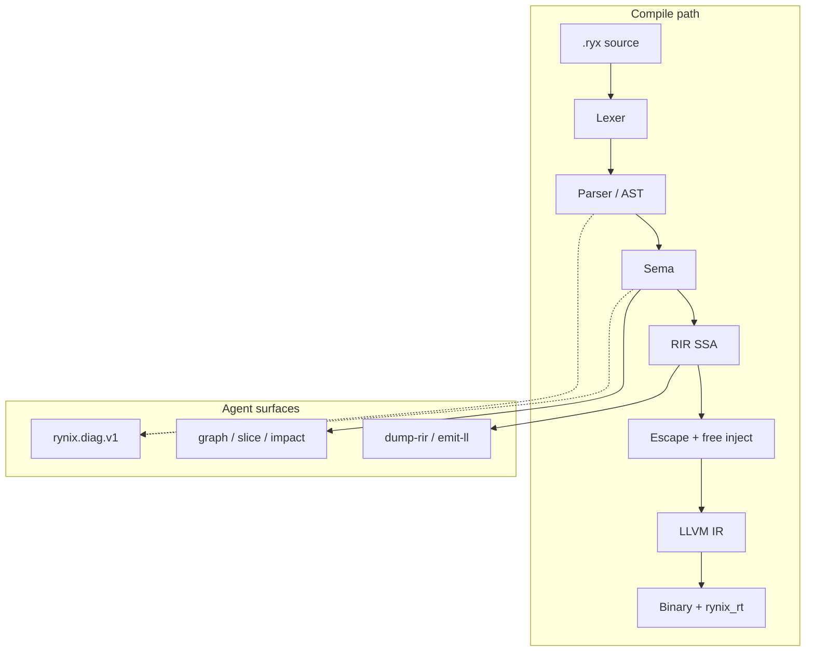

# Rynix

**AI-native systems language** — canonical syntax, Zero-GC escape path, colorless  
fibers, machine-readable diagnostics, textual LLVM backend, honest benchmarks.

`.ryx` · `rynixc` · phases **0–10** gated · Roadmap


[What is Rynix?](#what-is-rynix) · [Quick start](#quick-start) · [Pipeline](#compiler-pipeline) · [Runtime](#runtime--fibers) · [Memory](#memory-model) · [Tooling](#tooling-surface) · [Benchmarks](#benchmarks) · [Install](INSTALL.md) · Compare

---


## What is Rynix?

Rynix is a systems language built for **humans and agents**: one canonical spelling
per construct (`def`/`end`, newline statements), structured `rynix.diag.v1` JSON,
and CLI/MCP/LSP surfaces agents can call without scraping stdout.


|              |                                                                                             |
| ------------ | ------------------------------------------------------------------------------------------- |
| **Version**  | `0.1.0` — phases **0–10** acceptance-gated                                                  |
| **Compiler** | Rust (`crates/`)                                                                            |
| **Runtime**  | C (`rt/`) — fibers, TCP, json/http, io_uring                                                |
| **Backend**  | Textual LLVM IR → clang ThinLTO ([ADR-0005](docs/adr/0005-textual-llvm-ir-first.md))        |
| **Proof**    | `[docs/ROADMAP.md](docs/ROADMAP.md)` · `[PRODUCTION_READINESS.md](PRODUCTION_READINESS.md)` |


Zig/Go in `[benchmarks/suite5/](benchmarks/suite5/)` are **peer workload implementations**,
not the compiler host.

---

## Why Rynix


| Pillar                  | Shipping today                                   | Proof                                            |
| ----------------------- | ------------------------------------------------ | ------------------------------------------------ |
| **Canonical syntax**    | `def`/`end`, newline statements                  | `[docs/SPEC.md](docs/SPEC.md)`, parser snapshots |
| **Zero-GC path**        | Escape → stack / region / heap + injected `free` | `--explain-alloc`, MCP `rynix_explain_alloc`     |
| **Colorless I/O**       | Fibers + `PARKED`; io_uring harvest on Linux     | `rt/tests/`*, ASan CI                            |
| **AI-native toolchain** | NDJSON diags, MCP (11 tools), graph/impact/eval  | `[docs/schemas/](docs/schemas/)`, `agent_cli`    |
| **Editor + arch guard** | VS Code + LSP; `Architecture.toml`               | `phase10_gates`, `editors/vscode/`               |
| **Small binaries**      | Hello under **300 KiB** (clang gate)             | `size_echo_gates`                                |


> **vs [End](https://github.com/IrMaho/End):** we match AI CLI + `arch check` and lead on
> test-gated LLVM↔interp + escape transparency. End still leads editor richness (CodeLens,
> studio) and UI/frameworks — `[docs/COMPARE.md](docs/COMPARE.md)`.

---

## Compiler pipeline

### ASCII (renders everywhere)

```text
  .ryx source
       │
       ▼
  ┌─────────┐    ┌──────────────┐    ┌──────┐    ┌─────────┐
  │  Lexer  │───▶│ Parser / AST │───▶│ Sema │───▶│ RIR SSA │
  └─────────┘    └──────────────┘    └──┬───┘    └────┬────┘
       │                 │               │             │
       │                 └───────────────┴─────────────┤
       │                         rynix.diag.v1 ◀───────┤
       │                                             ▼
       │                              ┌──────────────────────────┐
       │                              │ Escape + region + free   │
       │                              └────────────┬─────────────┘
       │                                           ▼
       │                              ┌──────────────────────────┐
       │                              │ LLVM IR (.ll) + ThinLTO    │
       │                              └────────────┬─────────────┘
       │                                           ▼
       └──────────────────────────────▶ binary + rynix_rt (C)
```

### Mermaid (GitHub / compatible viewers)




### `rynixc` command surface

```text
Core:     lex · parse · check · dump-rir · emit-ll · build · run · test · fmt
Agent:    graph · slice · impact · eval · patch · arch check
Servers:  mcp-serve · lsp-serve
```

---

## Runtime & fibers

Blocking-looking std calls lower to **fiber yield + PARKED**; Linux builds can
harvest **io_uring** completions inside `rynix_rt_run`.

```text
  main thread                         fiber A              fiber B
      │                                  │                    │
      ├─ rynix_rt_run() ◀── scheduler ────┤                    │
      │       │                          │                    │
      │       ├─ tcp_recv (would block)  │                    │
      │       │      └─ PARKED ─────────▶│                    │
      │       ├─ run ready fiber ────────────────────────────▶│
      │       └─ io_uring CQ harvest (Linux, --runtime=uring) │
      │                                  │                    │
      └─ resume on I/O complete ◀────────┴────────────────────┘
```


| Runtime  | Flag                 | Platform                               |
| -------- | -------------------- | -------------------------------------- |
| Portable | `--runtime=portable` | Windows (default), Linux fallback      |
| io_uring | `--runtime=uring`    | Linux when built with `RYNIX_RT_URING` |


ABI reference: `[docs/abi.md](docs/abi.md)`

---

## Memory model

Escape analysis assigns each allocation site a tier; the compiler injects `free`
where heap escape is proven.

```text
  NoEscape ──────▶ stack slot
  ArgEscape ─────▶ caller region / bump arena
  RegionEscape ──▶ scoped region (loop / handler)
  GlobalEscape ──▶ heap + compiler-injected free
```

```sh
rynixc check file.ryx --explain-alloc --error-format=json
```

---

## Quick start

### Install

```sh
# Unix
chmod +x INSTALL.sh && ./INSTALL.sh

# Windows (PowerShell)
.\install.ps1

# Manual
cargo install --path crates/rynixc --force
```

**Prerequisites:** Rust (`[rust-toolchain.toml](rust-toolchain.toml)`), `clang` on `PATH`.
Windows: MinGW `x86_64-w64-mingw32-clang` + `x86_64-pc-windows-gnu`. Details:
`[INSTALL.md](INSTALL.md)`.

### First run

```sh
cargo test --workspace

rynixc run examples/01_hello.ryx
rynixc check examples/03_vec.ryx --explain-alloc --error-format=json
rynixc graph examples/02_match_loop.ryx
rynixc arch check
rynixc build examples/03_vec.ryx -o target/ex_vec --runtime=portable
rynixc run examples/05_http_json.ryx    # json_get_i64 → stdout 42
```

### Verify (CI-equivalent)

```sh
cargo clippy -p rynixc -p rynix-rir -p rynix-codegen -p rynix-sema -- -D warnings
rynixc arch check --error-format=json
python benchmarks/suite5/run_suite5.py --langs c,rynix
cd editors/vscode && npm ci && npm run compile
```

---

## Language snapshot

```ryx
def main() -> i64
  let v: Vec[i64] = vec_new(0)
  v.push(1)
  v.push(2)
  let ok = true and v.len() == 2
  match ok
    true
      return v.get(0) + v.get(1)
    false
      return 0
  end
  return -1
end
```

### Examples


| File                                              | Demonstrates                |
| ------------------------------------------------- | --------------------------- |
| `[01_hello.ryx](examples/01_hello.ryx)`           | `print`                     |
| `[02_match_loop.ryx](examples/02_match_loop.ryx)` | `match` + `loop`            |
| `[03_vec.ryx](examples/03_vec.ryx)`               | `Vec[i64]` methods          |
| `[04_bool_logic.ryx](examples/04_bool_logic.ryx)` | `and` / `or`                |
| `[05_http_json.ryx](examples/05_http_json.ryx)`   | `json_get_i64` (no network) |


### Soft builtins (v0.1)


| Area        | API                                                                            | Limits                                                                                    |
| ----------- | ------------------------------------------------------------------------------ | ----------------------------------------------------------------------------------------- |
| I/O         | `print`, `print_i64`                                                           | Host write                                                                                |
| Fibers      | `spawn` (stmt), `yield`, `sleep_ms`, `now_ms`, `fiber_run`                     | Colorless concurrency; PARKED in `rt/` ([SPEC](docs/SPEC.md))                             |
| Collections | `vec_new`, `map_new`, methods                                                  | Mono `Vec[i64]` / `Map[i64,i64]` ([ADR-0006](docs/adr/0006-monomorphized-collections.md)) |
| TCP         | `tcp_listen`, `tcp_accept`, `tcp_connect`, `tcp_recv`, `tcp_send`, `tcp_close` | Fiber-safe `rt/` loops                                                                    |
| JSON / HTTP | `json_get_i64`, `http_get_json_i64`                                            | Int fields only; CI tests json + connect-fail                                             |
| Reserved    | `tensor`, `signal`, `agent`                                                    | Keywords — stubs, not full std                                                            |


Grammar: `[docs/SPEC.md](docs/SPEC.md)`

---

## Architecture guard

`[Architecture.toml](Architecture.toml)` defines layout dirs and layer invariants.

```text
  Architecture.toml
        │
        ▼
  rynixc arch check ──▶ scan all .ryx under root
        │
        ├── layout: required dirs exist?
        └── invariants: forbidden imports / calls per glob
                │
                ▼
        pass │ violation_detected
                │
                └── --error-format=json → rynix.arch.v1
```

```sh
rynixc arch check
rynixc arch check --error-format=json
```

Schema: `[docs/schemas/rynix.arch.v1.json](docs/schemas/rynix.arch.v1.json)`

---

## Benchmarks

Full index: `[benchmarks/README.md](benchmarks/README.md)`

### Suite5 — 12 workloads × 5 languages

Same **integer algorithms** in **Rynix · C · Rust · Go · Zig**. Each binary prints one
checksum; CI requires **C ↔ Rynix match on all 12** — not a crown-speed claim.

```sh
python benchmarks/suite5/run_suite5.py --summary
python benchmarks/suite5/run_suite5.py --langs c,rynix    # CI subset
```

Sample local run (Windows, 2026-08-22; **re-run on your machine** — trimmed median ms,
warmup=3, runs=9; drops min/max when runs≥5).
**All 12 C ↔ Rynix checksums pass** (`phase10_gates` + CI `suite5-check`).


| Workload | C   | Rust | Go  | Zig | Rynix  | Rynix/C   |
| -------- | --- | ---- | --- | --- | ------ | --------- |
| alu      | 9   | 8    | 12  | 9   | 8      | 0.92×     |
| nested   | 7   | 6    | 10  | 8   | 8      | 1.08×     |
| fib      | 9   | 7    | 11  | 8   | 9      | 1.04×     |
| hash     | 21  | 19   | 20  | 20  | 17     | 0.80×     |
| prime    | 12  | 11   | 16  | 12  | 12     | 0.98×     |
| sum      | 7   | 6    | 10  | 7   | 7      | 1.07×     |
| bits     | 461 | 440  | 442 | 496 | **93** | **0.20×** |
| matrix   | 8   | 10   | 68  | 8   | 7      | 0.92×     |
| scan     | 9   | 16   | 15  | 18  | 9      | 1.00×     |
| powmod   | 16  | 15   | 18  | 16  | 17     | 1.02×     |
| gcd      | 174 | 163  | 213 | 167 | 162    | 0.93×     |
| reduce   | 11  | 16   | 20  | 14  | 11     | 0.99×     |


Times are trimmed median ms from `run_suite5.py` (not a crown claim). Your machine → `suite5_results.json`.
Details: `[benchmarks/suite5/README.md](benchmarks/suite5/README.md)`

**Performance honesty:** Rynix is **not** at a perf ceiling. Most microkernels are within ~±15% of C;
`bits` leads after `@llvm.ctpop` lowering (~0.20× C on this run). Compiler wins in-tree: counted-loop SSA,
`urem`, `ctpop`, `×31→lshl`, guarded-loop peel (non-nested), gcd inline + urem, short-circuit `and`/`or` in `if`,
loop `break` exit phis, `i*j+i` → `i*(j+1)` fold, guarded outer loop when nested loops are simple counted exits, merged guarded-loop exit blocks, loop-invariant `iconst` hoist, LLVM loop vectorizer hints on latch back-edges. Optional PGO: `python benchmarks/suite5/run_pgo_suite.py` — see `[suite5/README.md](benchmarks/suite5/README.md)`.

### vs End [suite12](https://github.com/IrMaho/End/tree/main/benchmarks/suite12)


|       | End                                       | Rynix                                      |
| ----- | ----------------------------------------- | ------------------------------------------ |
| Shape | 12 challenges × 5 langs                   | **12 workloads × 5 langs** (Suite5)        |
| Style | Heavy sims (SDF, HFT, SHA-256, N-body, …) | Integer microkernels + checksum CI         |
| Stats | 5 runs + warmup                           | `--summary` matrix; optional local re-runs |


Different algorithms — **not row-comparable**. Rynix matches the **honest multi-lang**
shape; End still leads on spectacle benches. Mapping: `[benchmarks/README.md](benchmarks/README.md)`.

### Other harnesses


| Harness                       | Reference                                                                    |
| ----------------------------- | ---------------------------------------------------------------------------- |
| TCP echo RPS (fibers)         | `[docs/bakeoff.md](docs/bakeoff.md)` + optional `scripts/bakeoff_go_echo.go` |
| Lexer throughput (~400 MiB/s) | `[docs/benchmarks.md](docs/benchmarks.md)`                                   |
| Hello binary size             | `hello_binary_under_300kb` in `size_echo_gates`                              |


```text
  Suite5 (CPU micro)          Bakeoff (I/O)
  ─────────────────           ─────────────
  checksum gate first         fiber TCP echo RPS
  5 langs / 12 workloads      optional Go peer
         │                           │
         └──────── benchmarks/README.md ────────┘
```

---

## Acceptance gates

Every ✅ in `[docs/ROADMAP.md](docs/ROADMAP.md)` maps to a test or CI job.


| Gate                       | Evidence                                              |
| -------------------------- | ----------------------------------------------------- |
| Hello under 300 KiB        | `size_echo_gates`                                     |
| Fiber / TCP / load / uring | `rt/tests/*`                                          |
| JSON unit + smoke          | `json_unit.c`, `json_smoke.c`                         |
| HTTP connect-fail          | `http_smoke.c`                                        |
| LLVM ↔ interpreter         | `diff_llvm_vs_interp`                                 |
| Phase 10 surface           | `phase10_gates` (arch, Suite5×12, http LLVM, VS Code) |
| LSP hover + goto-def       | `lsp_cmd` unit tests                                  |
| AI CLI JSON                | `agent_cli`                                           |
| ASan runtime               | CI Ubuntu sanitizer job                               |
| Clippy `-D warnings`       | CI clippy job                                         |


---

## Editor (VS Code)

```sh
cd editors/vscode && npm install && npm run compile
# or: .\editors\vscode\install_extension.ps1
```

```text
  .ryx file ──▶ VS Code extension ──▶ rynixc lsp-serve (stdio)
                         │
                         ├── diagnostics (check pipeline)
                         ├── hover (types)
                         └── go-to-definition
```


| Setting              | Purpose                |
| -------------------- | ---------------------- |
| `rynix.compilerPath` | Path to `rynixc`       |
| `rynix.enableLsp`    | Enable language server |


**v0.1:** grammar, diag, hover, def. **Not yet:** CodeLens, studio ([ADR-0007](docs/adr/0007-deferred-ui-frameworks.md)).

---

## Tooling surface

### AI-native CLI


| Command                          | Schema            | Purpose                  |
| -------------------------------- | ----------------- | ------------------------ |
| `check --error-format=json`      | `rynix.diag.v1`   | Structured diagnostics   |
| `graph`                          | `rynix.graph.v1`  | Call graph + edges       |
| `impact --fn=name`               | `rynix.impact.v1` | Callers / callees        |
| `eval --json`                    | `rynix.eval.v1`   | Constant expression eval |
| `arch check --error-format=json` | `rynix.arch.v1`   | Layer violations         |
| `slice`                          | —                 | Human outline            |
| `patch --write`                  | —                 | Apply compiler fixes     |


```sh
rynixc graph examples/02_match_loop.ryx
rynixc impact examples/02_match_loop.ryx --fn=main
rynixc eval --json "10 + 5"
```

Schemas: `[docs/schemas/](docs/schemas/)` · Agent guide: `[AGENTS.md](AGENTS.md)`

### MCP server

Start: `rynixc mcp-serve` (stdio JSON-RPC).


| #   | Tool                  | Role                  |
| --- | --------------------- | --------------------- |
| 1   | `diagnostics`         | File diagnostics      |
| 2   | `rynix_check`         | Check pipeline        |
| 3   | `rynix_format`        | Format source         |
| 4   | `rynix_explain_alloc` | Escape / alloc sites  |
| 5   | `compile`             | Build IR / binary     |
| 6   | `ast_query`           | AST queries           |
| 7   | `apply_fix`           | Apply suggested fixes |
| 8   | `rynix_graph`         | Call graph JSON       |
| 9   | `rynix_impact`        | Impact analysis       |
| 10  | `rynix_eval`          | Eval expressions      |
| 11  | `rynix_arch`          | Architecture check    |


### Release

Tag `v*` → GitHub Release: Linux + Windows `rynixc`, per-artifact SHA256,
`SHA256SUMS.txt` (`[.github/workflows/release.yml](.github/workflows/release.yml)`).

---

## Repository layout

```text
Rynix/
├── crates/                 # span → lexer → ast → parser → sema → rir → codegen
│   └── rynixc/             # CLI, LSP, MCP, arch, agent commands
├── rt/                     # rynix_rt_* runtime (C)
│   ├── include/            # public ABI header
│   ├── src/                # fiber, net, json, http, uring, collections
│   └── tests/              # C smokes (ASan in CI)
├── examples/               # runnable .ryx
├── benchmarks/suite5/      # 12 cross-lang workloads + harness
├── editors/vscode/         # LSP client + TextMate grammar
├── std/                    # prelude notes (.ryx docs)
├── docs/                   # SPEC, ROADMAP, ABI, ADRs, JSON schemas
├── Architecture.toml       # layer invariants
├── install.ps1 / INSTALL.sh
└── AGENTS.md               # guide for AI agents
```

---

## CI & quality

`[/.github/workflows/ci.yml](.github/workflows/ci.yml)`:

```text
  push / PR
     ├── test (Ubuntu + Windows)     cargo test --workspace
     ├── clippy                      -D warnings
     ├── suite5-check                C ↔ Rynix checksum
     ├── arch-check                  Architecture.toml
     ├── vscode-extension            npm ci && compile
     └── sanitizer (Ubuntu)          ASan: fiber, TCP, json, http, load
           └── uring smokes (Linux)   SQE + TCP + load
```

---

## Status


| Scope                 | Detail                                                                                        |
| --------------------- | --------------------------------------------------------------------------------------------- |
| **Shipping**          | Phases **0–10** — `[docs/ROADMAP.md](docs/ROADMAP.md)`                                        |
| **Deferred**          | C11 backend — [ADR-0008](docs/adr/0008-deferred-c11-backend.md)                               |
| **Out of scope v0.1** | UI, hot-reload, canvas — [ADR-0007](docs/adr/0007-deferred-ui-frameworks.md)                  |
| **Not claimed**       | End-style heavy suite12 sims (SDF/HFT/SHA), inkwell, parametric `Vec[T]`, GPG-signed releases |


---

## Documentation


| Document                                             | Contents                         |
| ---------------------------------------------------- | -------------------------------- |
| `[INSTALL.md](INSTALL.md)`                           | Install, verify, troubleshooting |
| `[docs/SPEC.md](docs/SPEC.md)`                       | Grammar & builtins               |
| `[docs/abi.md](docs/abi.md)`                         | Runtime symbols                  |
| `[docs/diagnostics.md](docs/diagnostics.md)`         | `RYX####` codes                  |
| `[docs/COMPARE.md](docs/COMPARE.md)`                 | Peer comparison (End, etc.)      |
| `[PRODUCTION_READINESS.md](PRODUCTION_READINESS.md)` | Subsystem matrix                 |
| `[SECURITY.md](SECURITY.md)`                         | Vulnerability reporting          |
| `[CONTRIBUTING.md](CONTRIBUTING.md)`                 | Contribution guide               |
| `[docs/adr/](docs/adr/)`                             | Architecture decisions           |


---


**Rynix v0.1.0** — built to be verified, not merely advertised.

